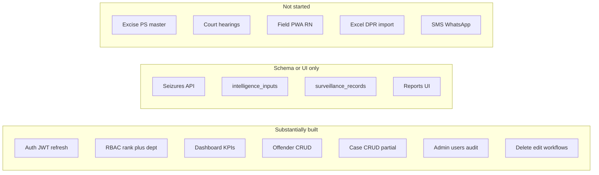
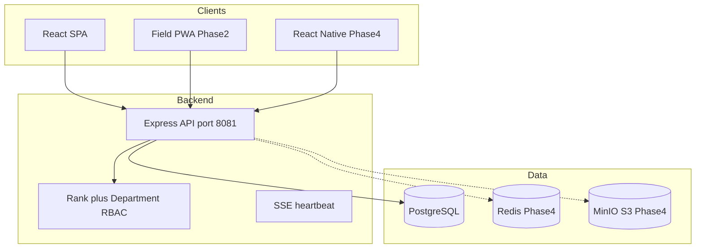
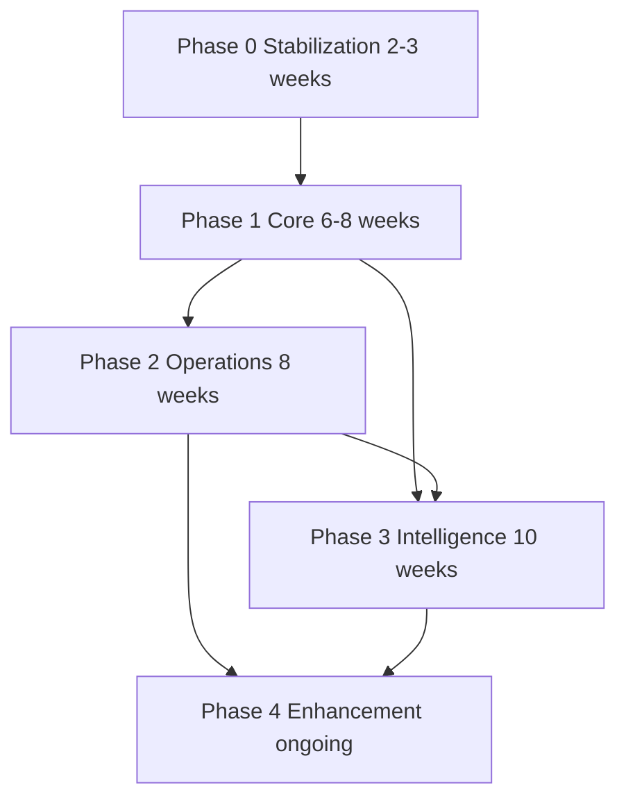
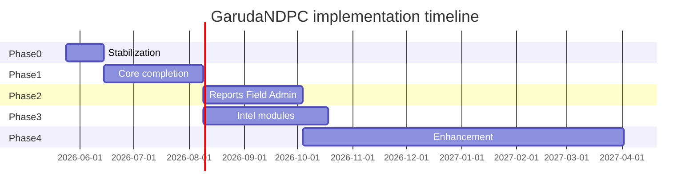

# NDPS Implementation Roadmap — GarudaNDPC (GARUDA)

**Project:** NDPS Monitoring & Intelligence Management System  
**Client:** Tirupati District Police & Excise Department  
**Repository:** `GarudaNDPC`  
**Reference spec:** `NDPS_System_Implementation_Prompt.md` (Tirupati District, cases 2016–2026)  
**Document version:** 1.0 — May 2026  
**Classification:** Official Use Only

---

## 1. Purpose

This document is the **single source of truth** for:

- Where the GarudaNDPC codebase stands relative to the full NDPS system specification
- What blocks users today (stabilization / technical debt)
- **What to build next**, in phase order, with acceptance criteria and file touchpoints

It does **not** duplicate the full spec. For page-level feature definitions, role matrices, and data field lists, refer to the implementation prompt (§3–§10).

---

## 2. Executive summary — where we are

| Dimension | Status |
|-----------|--------|
| **Overall progress** | **Phase 1 in progress** (~75% of spec Phase 1); Phase 0 stabilization largely complete |
| **Architecture** | Monorepo: Express 5 + Prisma + PostgreSQL (API `:8081`), React 19 + Vite + Tailwind (UI `:3000`) |
| **Module routing** | All 9 spec pages have routes and navigation shells |
| **Working end-to-end** | Auth, dashboard (partial), offenders (buggy), cases (partial), admin users/teams/audit, deletion/edit workflows |
| **Schema vs API** | Database model is **ahead** of API and UI for intelligence, surveillance, and full case lifecycle |
| **Not started** | Excise station master, Excel/DPR import, field mobile/PWA, reports API, intelligence modules, React Native, Redis, S3, SMS/WhatsApp |

**You are here:** Complete **Phase 0 (stabilization)** → finish **Phase 1 (core)** → then **Phase 2 (operations)** and **Phase 3 (intelligence)** in parallel where teams allow.



### Mapping to spec implementation phases (§8)

| Spec phase | Spec scope | GarudaNDPC status |
|------------|------------|-------------------|
| **Phase 1 — Core (Months 1–3)** | Auth, cases, offenders, basic dashboard, Excel import | **In progress** — auth/admin/workflows strong; cases/offenders/dashboard incomplete; import not started |
| **Phase 2 — Operations (Months 4–5)** | Reports, mobile field entry, admin | **UI shells only** for reports and field staff |
| **Phase 3 — Intelligence (Months 6–8)** | Surveillance, network, finance, advanced analytics | **UI shells only**; tables exist, no APIs |
| **Phase 4 — Enhancement (Month 9+)** | GPS heatmaps, court SMS, offline mobile, ED/STF sharing | **Not started** |

This roadmap adds **Phase 0 — Stabilization** before continuing Phase 1, because integration bugs currently prevent reliable use of built features.

---

## 3. As-built architecture

### 3.1 Repository layout

```
GarudaNDPC/
├── backend/                 # Express + TypeScript API
│   ├── prisma/schema.prisma # PostgreSQL schema
│   ├── src/
│   │   ├── server.ts        # Route mounting
│   │   ├── config/roles.ts  # RBAC matrix
│   │   ├── controllers/     # Business logic
│   │   ├── middleware/      # JWT + authorize
│   │   └── routes/          # API routers
│   └── seed-full.ts         # Tirupati PS, teams, demo users
├── frontend/                # React SPA
│   └── src/
│       ├── main.jsx         # App routing (entry)
│       ├── pages/           # Feature screens by module
│       ├── hooks/usePermissions.js
│       └── context/AuthContext.jsx
└── docs/
    └── NDPS_IMPLEMENTATION_ROADMAP.md  # This file
```

### 3.2 Technology stack

| Layer | Implemented | Spec recommendation | Gap |
|-------|-------------|---------------------|-----|
| Frontend | React 19, Vite 8, Tailwind 4, Recharts | React + Tailwind | Telugu UI deferred |
| Backend | Express 5, TypeScript, Prisma 5 | Node/Express or Django | — |
| Database | PostgreSQL | PostgreSQL | — |
| Cache / sessions | — | Redis | Phase 4 |
| Auth | JWT 8h + refresh tokens in DB | JWT + RBAC | 2FA for SP/DSP/Admin — Phase 4 |
| File storage | — | S3 / MinIO | Phase 4 |
| Mobile | Web placeholder `/mobile` | React Native | Phase 2 PWA, Phase 4 RN |
| Maps | — | Leaflet / Google Maps | Phase 3–4 |
| Real-time | SSE (`/api/sse`) | Alerts | Notifications Phase 2 |
| Deployment | Local dev only | Docker + Nginx | Phase 4 |

### 3.3 System context diagram



### 3.4 API surface (implemented)

Base URL: `http://localhost:8081/api`

| Prefix | Purpose |
|--------|---------|
| `/auth` | login, refresh, logout, me |
| `/offenders` | list, get, create, update |
| `/cases` | create, list, get, accused update, seizure update, by-offender |
| `/dashboard` | summary KPIs and charts |
| `/police-stations` | station master |
| `/deletion-requests` | multi-step deletion workflow |
| `/edit-requests` | pending edit approval workflow |
| `/admin` | users, teams, audit logs |
| `/sse` | connect, status |

**Not implemented:** `/reports`, `/surveillance`, `/finance`, `/network`, file upload, case `PUT`, intelligence CRUD.

---

## 4. Current-state matrix (Pages 1–9)

| Page | Spec route | Completion | Backend | Frontend | Notes |
|------|------------|------------|---------|----------|-------|
| 1 Command Dashboard | `/dashboard` | ~70% | `dashboard.controller.ts` | `Dashboard.jsx` | Drug breakdown & 2016–2025 trend partly hardcoded; no alert feed / absconder ticker |
| 2 Offender Database | `/offenders` | ~55% | `offenders.controller.ts` | `OffenderList.jsx`, `OffenderForm.jsx` | Rich nested profile; no interrogation PDF/history sheet/IMEI/export; API bugs |
| 3 Case Management | `/cases` | ~45% | `cases.controller.ts` | `CaseManagement.jsx`, `CaseForm.jsx`, `CaseDetail.jsx` | No charge sheet/court/bail modules; no `PUT`; accused/seizure not in registration form |
| 4 Field Staff | `/mobile` | ~5% | — | `field/FieldStaff.jsx` | All tabs: "Coming in Phase 2" |
| 5 Technical Surveillance | `/surveillance` | ~5% | — | `surveillance/Surveillance.jsx` | `surveillance_records` in DB, no API |
| 6 Financial Analysis | `/finance` | ~15% | via offender only | `finance/FinancialAnalysis.jsx` | `offender_financials` on create/update; no transaction log or flow map |
| 7 Network & Chain | `/network` | ~10% | via offender only | `network/NetworkMap.jsx` | `supply_chain_links`; no graph builder |
| 8 Reports | `/reports` | ~10% | — | `reports/Reports.jsx` | Generate buttons not wired |
| 9 Admin | `/admin` | ~65% | `admin.controller.ts` | `admin/*.jsx` | Users, teams, audit; no import, notification config, system health |

### 4.1 Database entities — coverage

| Entity / table | In schema | API | UI | Spec alignment |
|----------------|-----------|-----|-----|----------------|
| `users`, `refresh_tokens` | Yes | Yes | Yes | Partial — lockout fields unused |
| `police_stations` | Yes | Yes | Yes | Police only; no Excise type |
| `teams` | Yes | Yes | Yes | Admin teams, not spec divisions |
| `offenders` + contacts, identity, drug, financials | Yes | Yes | Yes | Strong base for Page 2 |
| `cases`, `case_accused` | Yes | Partial | Partial | Missing contraband/court fields on case |
| `seizures` | Yes | POST only | Case detail | Weak link in case registration |
| `supply_chain_links` | Yes | Via offender | Offender form | Not full network graph |
| `intelligence_inputs` | Yes | No | No | Page 5 partial |
| `surveillance_records` | Yes | No | No | Page 4/5 |
| `deletion_requests`, `edit_requests` | Yes | Yes | Yes | Beyond spec — keep |
| `audit_logs` | Yes | Yes | Yes | Spec §9.3 |
| `interrogation_sessions` | No | No | No | Spec Page 2.4 |
| `court_hearings`, `charge_sheets` | No | No | No | Spec Page 3.3–3.4 |
| `imei_records`, `transaction_records` | No | No | No | Spec Pages 5–6 |
| `network_nodes`, `network_edges` | No | No | No | Spec Page 7 — or evolve `supply_chain_links` |

---

## 5. Technical debt register (Phase 0 blockers)

These issues **must be fixed** before Phase 1 acceptance. They currently block SI/CI daily use.

### 5.1 Permission key mismatch (Critical)

| Location | Uses | Should use |
|----------|------|------------|
| `backend/src/routes/cases.routes.ts` | `ADD_CASE`, `EDIT_RECORDS` | `CASE_CREATE`, `OFFENDER_EDIT` (or add aliases in `roles.ts`) |
| `backend/src/routes/offenders.routes.ts` | `ADD_CASE`, `EDIT_RECORDS` | `OFFENDER_CREATE`, `OFFENDER_EDIT` |
| `backend/src/config/roles.ts` | `CASE_CREATE`, `OFFENDER_EDIT`, … | Source of truth |

`requirePermission()` calls `hasPermission()` which returns **false** for unknown keys → **403** on create/update.

**Fix:** Align route middleware keys with `PERMISSIONS` in `roles.ts`, or register legacy aliases.

### 5.2 Frontend ↔ API contract mismatches

| Issue | Frontend | Backend | Files |
|-------|----------|---------|-------|
| Police stations URL | `GET /ps` | `GET /police-stations` | `OffenderList.jsx`, `OffenderForm.jsx` |
| Offender search param | `q` | `query` | `OffenderList.jsx`, `offenders.controller.ts` |
| Case update | `PUT /cases/:id` | Route missing | `CaseForm.jsx`, `cases.routes.ts` |
| Case detail fields | `fir_no`, `police_stations` | camelCase `firNo`, nested station | `CaseDetail.jsx`, `cases.controller.ts` |

### 5.3 Edit-request schema drift (Critical)

**Schema** (`edit_requests`): `changes_json`, `requested_by`, `requested_at`, `approved_by`, `approved_at`

**Controller** likely references: `old_data`, `new_data`, `edit_requested_by_user`, `request_date`, `approved_date`

**Files:** `backend/src/controllers/edit_request.controller.ts`, `frontend/src/pages/workflows/EditRequests.jsx`

**Fix:** Align controller to Prisma model; implement apply-on-approve logic (currently noted as missing).

### 5.4 Enum mismatches (Offender form)

UI values must match Prisma enums in `schema.prisma`:

| Area | Prisma enum | Example UI mistake |
|------|-------------|-------------------|
| Contacts | `contact_type` | `MOBILE_1` → use `MOBILE_PRIMARY` |
| Category | `offender_category` | `SUPPLIER` → use `LOCAL_SUPPLIER` |
| Drug profile | `addiction_type`, `consumption_frequency`, etc. | Free text vs enum |

**File:** `frontend/src/pages/offenders/OffenderForm.jsx`

### 5.5 Dashboard mock data

`dashboard.controller.ts` uses hardcoded year trend (2016–2025) and drug breakdown instead of aggregating `cases` + `seizures`.

### 5.6 Security gaps

| Item | Location | Phase |
|------|----------|-------|
| Default JWT secret in code | `auth.middleware.ts`, `auth.controller.ts` | Phase 0 — use `process.env.JWT_SECRET` |
| Account lockout fields on `users` not enforced | `auth.controller.ts` login | Phase 0 |
| Aadhaar not encrypted at rest | `offender_identity_docs` | Phase 1 |
| PII reveal not audit-logged | — | Phase 1 |
| No 2FA | — | Phase 4 |

---

## 6. Architecture decisions

### 6.1 Roles: rank + department (keep and extend)

The spec defines **15 role IDs**. The codebase uses a **cleaner two-axis model**:

- **`user_role`** (rank): `ADMIN`, `SP`, `ASP`, `DSP`, `CI`, `SI`, `CONSTABLE`
- **`department_type`** (org unit): `ADMINISTRATION`, `OPERATIONS`, `INTELLIGENCE`, `FIN_CELL`, `TECH_CELL`, `ANALYST`, `LEGAL`, `STF`

**Decision:** Do **not** add 15 duplicate enum values. Map spec roles to **(rank, department, station scope)** and enforce page-level matrices from spec §3–4 in `roles.ts` and `usePermissions.js`.

#### Spec role → Garuda mapping

| Spec role ID | Garuda rank | Department | Station scope |
|--------------|-------------|------------|---------------|
| `admin` | ADMIN | ADMINISTRATION | All |
| `sp` | SP | OPERATIONS (or any) | District |
| `dsp` | DSP | OPERATIONS | Division (when `divisions` added) |
| `ci` | CI | OPERATIONS | Own PS |
| `si` | SI | OPERATIONS | Own cases |
| `constable` | CONSTABLE | OPERATIONS | Assigned |
| `excise_officer` | SI or CONSTABLE | OPERATIONS | Excise PS |
| `excise_si` | SI | OPERATIONS | Excise PS |
| `excise_ci` | CI | OPERATIONS | Excise circle |
| `analyst` | SI+ | ANALYST | All (PII masked) |
| `tech_cell` | SI+ | TECH_CELL | All technical |
| `fin_cell` | SI+ | FIN_CELL | Financial |
| `stf_officer` | SI+ | STF | All |
| `prosecutor` | SI+ | LEGAL | Assigned cases, read-only court |
| `court_liaison` | SI+ | LEGAL | Court updates only |

**Note:** `ASP` exists in codebase but not in spec — treat as between SP and DSP or map to DSP equivalent.

### 6.2 Stations: add Excise type

**Decision:** Extend `police_stations` (or rename to `stations` in a future migration):

```prisma
enum station_type {
  POLICE
  EXCISE
}
// Add to police_stations: type station_type, ps_code, division_id (optional)
```

**Seed data (Phase 1):**

- **12 Excise PS:** TPT U, TPT R, SKHT, PTR, NGLP, CGR, TML, GDR, NDP, SLPT, VKD, VGR
- **30+ Police PS** in Tirupati District (from operational spreadsheets)

**File:** `backend/seed-full.ts`, new migration.

### 6.3 Row-level security

| Scope | Rule | Implementation |
|-------|------|----------------|
| SI | Own cases (`created_by` or assigned IO) | Filter in controllers |
| CI | Own `ps_id` | `WHERE ps_id = user.ps_id` |
| DSP | Own division | Requires `divisions` table + `users.division_id` |
| SP / Analyst / STF | District / all | No PS filter (analyst: mask PII) |
| Excise roles | Excise PS only | `station.type = EXCISE` |

Implement in a shared `scopeQuery(user, model)` helper — **Phase 1**.

### 6.4 Case lifecycle data model

**Option A (recommended):** Normalized tables for auditability and court diary queries.

| New model | Purpose |
|-----------|---------|
| `charge_sheets` | Expected/actual dates, checklist, prosecutor |
| `court_hearings` | SC number, date, judge, order, next date |
| `bail_records` | Application, grant/reject, surety, conditions |
| `interrogation_sessions` | Page 2.4 digital interrogation |

**Option B:** JSON columns on `cases` — faster to ship, harder to report. Use only for prototyping.

Extend `cases` with: `contraband_type`, `quantity`, `unit`, `street_value`, `source_location`, `destination_location`, `intelligence_notes`, `nature_of_offence`, `department` (police/excise).

### 6.5 Intelligence modules — single source of truth

- **Do not** duplicate accused data in surveillance/finance/network modules.
- All intel links via `offender_id` and/or `case_id` FKs.
- Correlation (duplicate mobile, shared associates) via **SQL views** + dedicated read APIs — Phase 3.

### 6.6 Audit extensions

Extend `backend/src/utils/auditLogger.ts` for:

- `PII_REVEALED` (Aadhaar, full mobile)
- `BULK_EXPORT`
- `LOGIN_FAILED` / lockout events

---

## 7. Phase-wise workflow

### Overview



| Phase | Duration (est.) | Spec §8 equivalent |
|-------|-----------------|-------------------|
| Phase 0 | 2–3 weeks | Pre-requisite |
| Phase 1 | 6–8 weeks | Phase 1 completion |
| Phase 2 | 8 weeks | Phase 2 |
| Phase 3 | 10 weeks | Phase 3 |
| Phase 4 | Ongoing | Phase 4 |

---

### Phase 0 — Stabilization and alignment

**Goal:** Make existing Phase 1 surfaces production-usable.  
**Duration:** 2–3 weeks  
**Owner:** Full-stack / platform

#### Task checklist

| # | Task | Priority | Files |
|---|------|----------|-------|
| 0.1 | Unify permission keys (`ADD_CASE` → `CASE_CREATE`, etc.) | P0 | `roles.ts`, `cases.routes.ts`, `offenders.routes.ts` |
| 0.2 | Fix frontend PS URL → `/police-stations` | P0 | `OffenderList.jsx`, `OffenderForm.jsx`, `CaseForm.jsx` |
| 0.3 | Fix offender search `q` → `query` | P0 | `OffenderList.jsx` |
| 0.4 | Add `PUT /api/cases/:id` + controller | P0 | `cases.routes.ts`, `cases.controller.ts` |
| 0.5 | Align edit-request controller to `edit_requests` schema | P0 | `edit_request.controller.ts` |
| 0.6 | Fix offender form enum values | P0 | `OffenderForm.jsx` |
| 0.7 | Fix case detail field mapping (camelCase) | P1 | `CaseDetail.jsx` |
| 0.8 | Dashboard: aggregate drug/station/year from DB | P1 | `dashboard.controller.ts` |
| 0.9 | JWT secret from environment; document `.env.example` | P0 | `auth.middleware.ts`, `auth.controller.ts` |
| 0.10 | Enforce login lockout (5 attempts / 15 min) | P1 | `auth.controller.ts`, `users` model |
| 0.11 | Sync `usePermissions.js` with backend `PERMISSIONS` | P1 | `usePermissions.js`, `roles.ts` |

#### Exit criteria

- [ ] SI can create and edit offender and case without 403
- [ ] Case edit saves via PUT
- [ ] Edit-request list/create/approve runs without schema errors
- [ ] Dashboard KPIs match database counts
- [ ] No hardcoded JWT secret in repository

---

### Phase 1 — Core completion

**Goal:** Complete spec Phase 1 — Pages 1–3, roles, Excel import.  
**Duration:** 6–8 weeks after Phase 0  
**Spec reference:** §4 Pages 1–3, §5 data model, §8 Phase 1

#### 1.1 Roles and master data

| Task | Deliverable | Files |
|------|-------------|-------|
| Add `station_type` + Excise PS seed | 12 Excise + 30+ Police stations | `schema.prisma`, migration, `seed-full.ts` |
| Add `divisions` (optional) | DSP division scoping | `schema.prisma`, `users.division_id` |
| Row-level scope helper | SI/CI/DSP filters | New `backend/src/utils/scope.ts`, all list controllers |
| Page-level RBAC matrix | Match spec tables per page | `roles.ts`, `usePermissions.js` |

#### 1.2 Page 2 — Offender database

| Task | Deliverable | Files |
|------|-------------|-------|
| Case history timeline API | Chronological cases per accused | `offenders.controller.ts`, `CaseDetail` / offender view |
| `interrogation_sessions` model + CRUD | Digital interrogation form §2.4 | `schema.prisma`, new routes |
| Aadhaar mask + reveal + audit | Masked by default; CI+ reveal logged | Offender API, `OffenderForm.jsx` |
| History sheet PDF | Generate/download | New PDF service or template |
| Export filtered list | Excel/PDF | New `/offenders/export` |
| IMEI register (basic) | Link mobiles to accused | New `imei_records` or extend contacts |

#### 1.3 Page 3 — Case management

| Task | Deliverable | Files |
|------|-------------|-------|
| Extend `cases` fields | Contraband, source/dest, intel notes | `schema.prisma`, `cases.controller.ts` |
| `charge_sheets`, `court_hearings`, `bail_records` | Lifecycle modules §3.3–3.5 | Schema + controllers + UI tabs on `CaseDetail.jsx` |
| Status timeline UI | Registered → Verdict visual | `CaseDetail.jsx` |
| CR auto-format | `PS-CODE/YEAR/SEQ` | `cases.controller.ts` |
| Accused + seizure in `CaseForm` | Full registration in one flow | `CaseForm.jsx` |
| Charge sheet due alerts | 60/180 day rules | Dashboard + notification stub |

#### 1.4 Page 1 — Dashboard enhancements

| Task | Deliverable | Files |
|------|-------------|-------|
| Live alert feed | Recent cases, arrests, CS due | `dashboard.controller.ts`, `Dashboard.jsx` |
| Absconder ticker | `offender_status = ABSCONDING` | Dashboard |
| Station heatmap | Real aggregation | Dashboard |

#### 1.5 Data import

| Task | Deliverable | Files |
|------|-------------|-------|
| Excel import admin UI | Map DPR columns §8.2 | `admin` routes, new `ImportData.jsx` |
| Import pipeline | Upsert cases, offenders, seizures | `import.service.ts`, validation |
| Historical load | 2016–2026 operational data | One-time seed scripts |

#### Exit criteria

- [ ] SP views district dashboard with live DB data (no mock years)
- [ ] Full case lifecycle fields capturable including charge sheet and court
- [ ] Excel DPR import succeeds for at least one Police and one Excise station sample
- [ ] Excise officer user sees only Excise station data
- [ ] Interrogation session saved and linked to accused

---

### Phase 2 — Operations

**Goal:** Reports, field operations, admin completion, notifications v1.  
**Duration:** ~8 weeks  
**Spec reference:** §4 Pages 4, 8, 9; §7 notifications; §8 Phase 2

**Can start in parallel with Phase 3 only after Phase 1 data model is stable.**

#### 2.1 Page 8 — Reports

| Task | Deliverable | Files |
|------|-------------|-------|
| Reports API | Standard reports §8.1 | `reports.routes.ts`, `reports.controller.ts` |
| Wire Generate buttons | Monthly abstract, absconder, pending CS, etc. | `Reports.jsx` |
| DPR export | Excel/PDF matching spreadsheet format | Export service |
| Court diary | Hearings next 7/30 days | `court_hearings` queries |
| Performance dashboard | SP/DSP station comparison | New page or dashboard tab |
| Custom report builder | Field/date/station filters | Phase 2b if timeboxed |

#### 2.2 Page 4 — Field staff (PWA first)

| Task | Deliverable | Files |
|------|-------------|-------|
| Mobile-responsive quick case entry | GPS, photo upload stub | `FieldStaff.jsx`, cases API |
| Accused verification search | History, bail, warrants | Offenders API |
| Surveillance report API | `surveillance_records` CRUD | New routes, `FieldStaff.jsx` |
| Checkpoint / nakabandhi log | New table or extend surveillance | Schema + UI |
| Informer module (restricted) | CI/SI/SP/DSP only | New `informers` table, RBAC |

**Defer to Phase 4:** Full offline sync, React Native, voice-to-text.

#### 2.3 Page 9 — Admin completion

| Task | Deliverable | Files |
|------|-------------|-------|
| Role permission UI | Toggle per module | `admin` UI |
| Notification thresholds | CS due, hearing, bail | Config table + admin UI |
| System health panel | Active users, DB size, last backup | Admin dashboard |
| Import UI | Trigger Excel import | `ImportData.jsx` |

#### 2.4 Notifications v1

| Alert (spec §7) | Implementation |
|-----------------|----------------|
| Charge sheet overdue | Cron or on-read check |
| Court hearing tomorrow | Query `court_hearings` |
| New case registered | SSE or in-app |
| Absconder > 30 days | Scheduled job |

**Channels:** In-app + email first; SMS gateway stub (MSG91/BSNL) for field officers.

#### Exit criteria

- [ ] Generate monthly station abstract and DPR Excel export
- [ ] Field officer submits GPS surveillance visible to CI+
- [ ] Court diary lists hearings for next 7 days
- [ ] Admin configures alert thresholds

---

### Phase 3 — Intelligence

**Goal:** Surveillance, finance, network modules + advanced analytics.  
**Duration:** ~10 weeks  
**Spec reference:** §4 Pages 5–7; §8 Phase 3

#### 3.1 Page 5 — Technical surveillance

| Model/API | Features |
|-----------|----------|
| `imei_records` | IMEI register, SIM swap history |
| `mobile_intel` or extend contacts | Number analysis, status |
| `social_media_intel` | Manual platform logs §5.4 |
| `intelligence_inputs` API | Wire existing table |
| Correlation engine | Duplicate mobile across cases → alert analyst/tech_cell |
| Geo map | Leaflet: surveillance clusters, layer toggles |

**Files:** `surveillance/Surveillance.jsx`, new controllers, `intelligence_inputs` routes.

#### 3.2 Page 6 — Financial analysis

| Model/API | Features |
|-----------|----------|
| `transaction_records` | Manual transaction log §6.2 |
| Financier flag | On accused + network |
| Asset seizure register | Extend `seizures` or new table |
| Money flow graph | react-flow / Cytoscape |
| UPI pattern notes | Linked to `offender_financials` |

**Files:** `finance/FinancialAnalysis.jsx`, new routes.

#### 3.3 Page 7 — Network and chain

| Task | Deliverable |
|------|-------------|
| Interactive graph | Nodes = accused, edges = supply_chain_links + manual |
| Interstate map | Source state → Tirupati routes |
| Network clusters | Auto-cluster by mobile, source, associates |
| Kingpin flag | `offenders.risk_score` + dossier view |
| Case linkage | Link cases sharing network |

**Files:** `network/NetworkMap.jsx`, graph API.

#### 3.4 Advanced dashboard

- Analyst view: all data, PII masked
- STF / tech_cell / fin_cell department KPIs
- District analytics SSE enhancements

#### Exit criteria

- [ ] Analyst runs duplicate-mobile correlation and receives alert
- [ ] fin_cell logs transaction and views money-flow map
- [ ] STF builds network graph with kingpin flagged
- [ ] Geo map shows surveillance hotspots

---

### Phase 4 — Enhancement (ongoing)

**Spec reference:** §8 Phase 4, §9 integrations, §10 NFRs

| Track | Items |
|-------|-------|
| Mobile | React Native app, offline queue, certificate pinning, device binding |
| Infrastructure | Redis caching, MinIO/S3 photos, Docker + Nginx, NIC deployment guide |
| Security | 2FA (SP/DSP/Admin), Aadhaar encryption at rest, AES-256, TLS hardening |
| Localization | Telugu for field app (names, addresses) |
| Integrations | SMS/WhatsApp (§9), e-Court API (medium), SCRB (medium), ED API (low) |
| Compliance | WCAG 2.1 AA, 99.5% uptime runbook, 10-year audit retention policy |

---

## 8. Cross-phase dependencies and parallel work



### Parallel tracks (after Phase 1 stable)

| Track A — Operations | Track B — Intelligence |
|----------------------|-------------------------|
| Reports + DPR export | Surveillance + IMEI |
| Field PWA | Financial analysis |
| Admin notifications | Network graph |
| Court diary | Correlation alerts |

**Shared dependency:** Stable `cases`, `offenders`, `court_hearings`, and station master.

---

## 9. Out of scope / deferred (per spec §9 priority)

| Integration | Priority | Target phase |
|-------------|----------|--------------|
| SMS Gateway (MSG91/BSNL) | High | Phase 2 stub, Phase 4 production |
| Maps (OSM/Leaflet) | High | Phase 3 |
| WhatsApp Business API | Medium | Phase 4 |
| NIC e-Court API | Medium | Phase 4 |
| SCRB cross-check | Medium | Phase 4 |
| Aadhaar OTP (UIDAI) | Low | Phase 4+ |
| Enforcement Directorate API | Low | Phase 4+ |
| Forensic / FSL lab module | Not in spec pages | Future if required |

---

## 10. Testing and quality gates

| Phase | Minimum quality gate |
|-------|---------------------|
| Phase 0 | Manual E2E: login → create offender → create case → edit → dashboard reflects counts |
| Phase 1 | Import sample Excel; role-scoped list returns correct row counts |
| Phase 2 | Report PDF/Excel opens in Excel; field surveillance appears on map |
| Phase 3 | Correlation alert fires on seeded duplicate mobile |
| Phase 4 | Load test 200 users; security review checklist |

**Recommendation:** Add Jest/API tests in Phase 0; Playwright smoke tests in Phase 1.

---

## 11. Key file index

| Area | Path |
|------|------|
| API entry | `backend/src/server.ts` |
| RBAC config | `backend/src/config/roles.ts` |
| Schema | `backend/prisma/schema.prisma` |
| Auth | `backend/src/controllers/auth.controller.ts` |
| Dashboard | `backend/src/controllers/dashboard.controller.ts` |
| Cases | `backend/src/controllers/cases.controller.ts` |
| Offenders | `backend/src/controllers/offenders.controller.ts` |
| Frontend routes | `frontend/src/main.jsx` |
| Permissions hook | `frontend/src/hooks/usePermissions.js` |
| Page shells | `frontend/src/pages/**` |
| Seed data | `backend/seed-full.ts` |

---

## 12. Document maintenance

Update this roadmap when:

- A phase exit criterion is met (check boxes in §7)
- Schema migrations add entities from §4.1
- Blockers in §5 are resolved (strike through or move to changelog)
- Spec version changes from district stakeholders

**Changelog**

| Date | Version | Change |
|------|---------|--------|
| 2026-05-23 | 1.0 | Initial roadmap from gap analysis vs NDPS_System_Implementation_Prompt.md |
| 2026-05-23 | 1.1 | Phase 0 stabilization + Phase 1 core started (schema, APIs, UI) |
| 2026-05-23 | 1.2 | Phase 1 continued: accused/seizure on case form, Aadhaar mask/reveal, CSV export, DPR import, history sheet print, DB year trend |

---

*Prepared for: Tirupati District Police & Excise Department — GarudaNDPC (GARUDA)*
