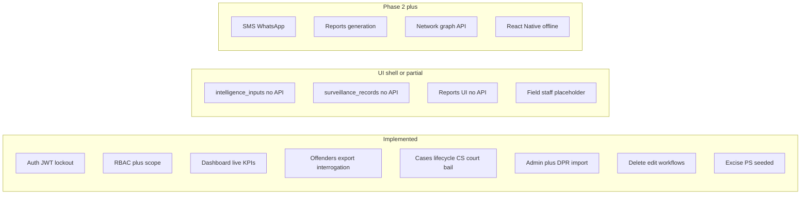
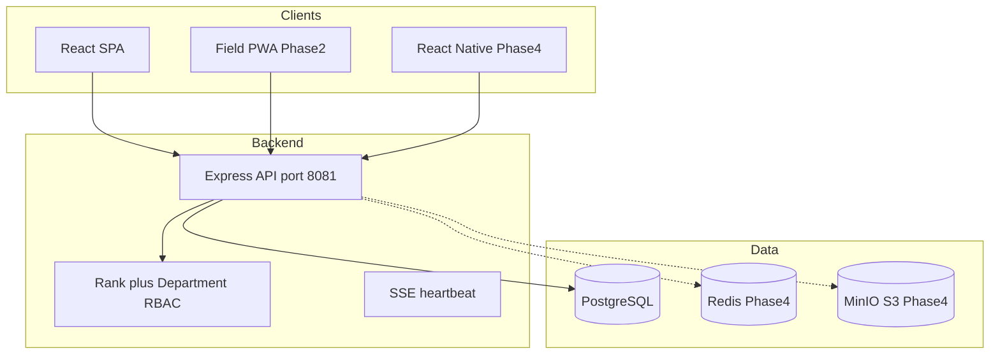
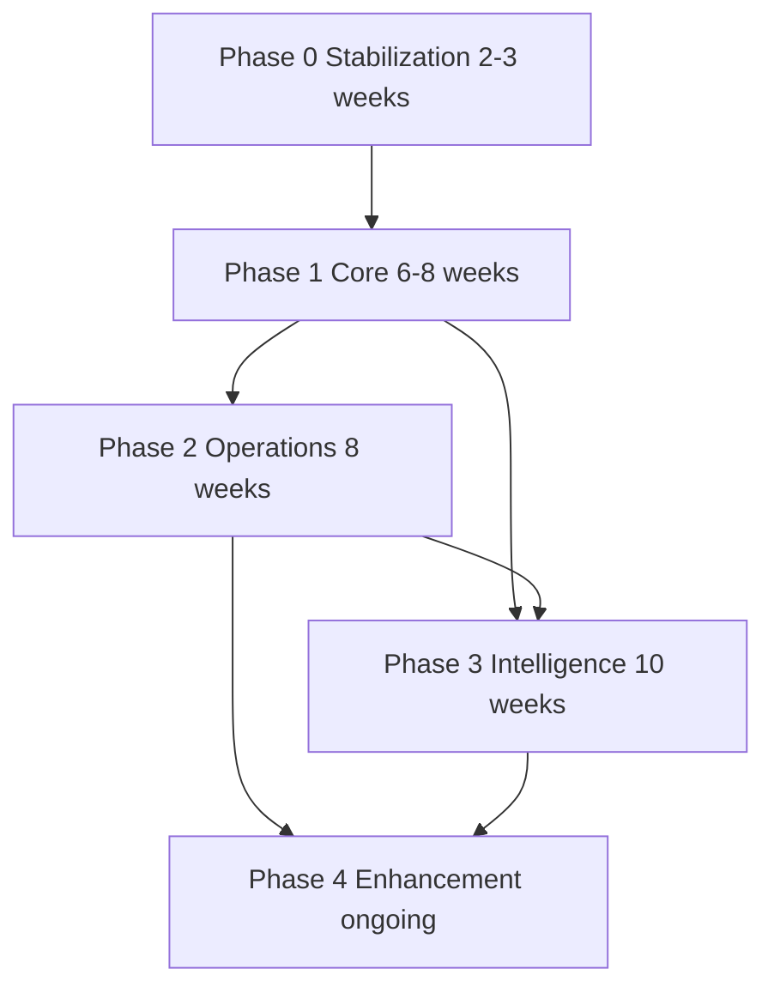
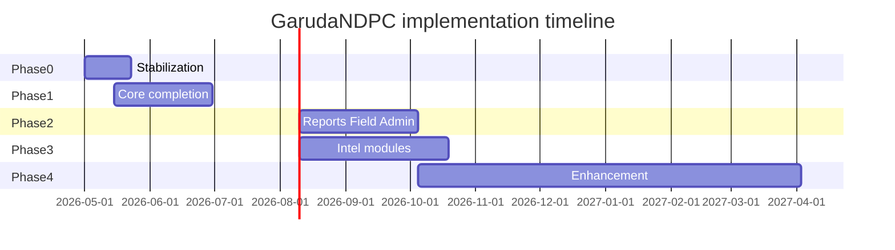

# NDPS Implementation Roadmap — GarudaNDPC (GARUDA)

**Project:** NDPS Monitoring & Intelligence Management System  
**Client:** Tirupati District Police & Excise Department  
**Repository:** `GarudaNDPC`  
**Reference spec:** `NDPS_System_Implementation_Prompt.md` (Tirupati District, cases 2016–2026)  
**Document version:** 1.3 — May 2026  
**Last updated:** 2026-05-23 (post Phase 0 + Phase 1 implementation)  
**Classification:** Official Use Only

---

## 1. Purpose

This document is the **single source of truth** for:

- Where the GarudaNDPC codebase stands relative to the full NDPS system specification
- What blocks users today (stabilization / technical debt)
- **What to build next**, in phase order, with acceptance criteria and file touchpoints

It does **not** duplicate the full spec. For page-level feature definitions, role matrices, and data field lists, refer to the implementation prompt (§3–§10).

---

## 2. Executive summary — where we are

| Dimension | Status |
|-----------|--------|
| **Overall progress** | **Phase 0 complete**; **Phase 1 ~90%** (spec Months 1–3 core); ready to start **Phase 2** |
| **Architecture** | Monorepo: Express 5 + Prisma + PostgreSQL (API `:8081`), React 19 + Vite + Tailwind (UI `:3000`) |
| **Module routing** | All 9 spec pages have routes and navigation |
| **Working end-to-end** | Auth (JWT + lockout), RBAC, dashboard, offenders (CRUD + export + interrogation), cases (full lifecycle tabs), admin (users/teams/audit/**DPR import**), deletion/edit workflows |
| **Schema vs API** | Core lifecycle tables wired; intelligence/surveillance tables exist but **no Phase 3 APIs yet** |
| **Not started (Phase 2+)** | Reports API, field PWA, intelligence module APIs, notifications/SMS, React Native, Redis, S3, 2FA |

**You are here:** Finish remaining Phase 1 polish (IMEI, PDF history sheet, division scoping, automated tests) → begin **Phase 2 (operations)**.



### Mapping to spec implementation phases (§8)

| Spec phase | Spec scope | GarudaNDPC status |
|------------|------------|-------------------|
| **Phase 0 — Stabilization** | Fix blockers before core | **Complete** (May 2026) |
| **Phase 1 — Core (Months 1–3)** | Auth, cases, offenders, dashboard, Excel import | **~90%** — see §7.1 checklist; remaining: IMEI, PDF history sheet, division RBAC, tests |
| **Phase 2 — Operations (Months 4–5)** | Reports, mobile field entry, admin | **Started** — DPR import UI done; reports/field still shells |
| **Phase 3 — Intelligence (Months 6–8)** | Surveillance, network, finance, advanced analytics | **Not started** (UI shells only; DB tables partial) |
| **Phase 4 — Enhancement (Month 9+)** | GPS heatmaps, court SMS, offline mobile, ED/STF sharing | **Not started** |

GarudaNDPC uses an internal **Phase 0** (stabilization) before spec Phase 1; both are now largely complete.

---

## 3. As-built architecture

### 3.1 Repository layout

```
GarudaNDPC/
├── backend/                 # Express + TypeScript API
│   ├── prisma/schema.prisma # PostgreSQL schema
│   ├── src/
│   │   ├── server.ts        # Route mounting
│   │   ├── config/roles.ts  # RBAC matrix
│   │   ├── controllers/     # Business logic
│   │   ├── middleware/      # JWT + authorize
│   │   └── routes/          # API routers
│   ├── prisma/migrations/phase1_core.sql
│   └── seed-full.ts         # Police + Excise PS, teams, demo users
├── frontend/                # React SPA
│   ├── src/components/      # CaseLifecyclePanel, OffenderPhase1Panels
│   └── src/pages/admin/DataImport.jsx
│   └── src/
│       ├── main.jsx         # App routing (entry)
│       ├── pages/           # Feature screens by module
│       ├── hooks/usePermissions.js
│       └── context/AuthContext.jsx
└── docs/
    └── NDPS_IMPLEMENTATION_ROADMAP.md  # This file
```

### 3.2 Technology stack

| Layer | Implemented | Spec recommendation | Gap |
|-------|-------------|---------------------|-----|
| Frontend | React 19, Vite 8, Tailwind 4, Recharts | React + Tailwind | Telugu UI deferred |
| Backend | Express 5, TypeScript, Prisma 5 | Node/Express or Django | — |
| Database | PostgreSQL | PostgreSQL | — |
| Cache / sessions | — | Redis | Phase 4 |
| Auth | JWT 8h + refresh tokens in DB | JWT + RBAC | 2FA for SP/DSP/Admin — Phase 4 |
| File storage | Multer + Excel import (in-memory) | S3 / MinIO | Phase 4 for evidence photos |
| Import / export | xlsx DPR import, CSV offender export | Excel/PDF reports | Phase 2 reports export |
| Mobile | Web placeholder `/mobile` | React Native | Phase 2 PWA, Phase 4 RN |
| Maps | — | Leaflet / Google Maps | Phase 3–4 |
| Real-time | SSE (`/api/sse`) | Alerts | Notifications Phase 2 |
| Deployment | Local dev only | Docker + Nginx | Phase 4 |

### 3.3 System context diagram



### 3.4 API surface (implemented)

Base URL: `http://localhost:8081/api`

| Prefix | Endpoints |
|--------|-----------|
| `/auth` | `POST /login`, `/refresh`, `/logout`; `GET /me` |
| `/offenders` | `GET /` (list, `query`, scope), `GET /export` (CSV), `GET /:id` (`?reveal=true` for Aadhaar), `POST /`, `PUT /:id`, `GET /:id/history-sheet`, `GET|POST /:offenderId/interrogations` |
| `/cases` | `POST /`, `GET /`, `GET /:id`, `PUT /:id`, `GET /offender/:offenderId`, `POST /:id/accused`, `POST /:id/seizures`, `GET|PUT /:id/charge-sheet`, `GET|POST /:id/court-hearings`, `GET|POST /:id/bail-records` |
| `/dashboard` | `GET /summary` (KPIs, trends, alerts, absconder ticker) |
| `/police-stations` | `GET /`, `GET /:id` |
| `/deletion-requests` | Full approval chain |
| `/edit-requests` | `GET /`, `POST /`, `POST /:id/approve`, `POST /:id/reject` |
| `/admin` | users, teams, audit-logs, `POST /import/dpr` (multipart Excel) |
| `/sse` | `GET /connect`, `GET /status` |

**Not implemented:** `/reports`, `/surveillance`, `/finance`, `/network` module APIs; photo/evidence upload to S3; automated notification dispatch.

---

## 4. Current-state matrix (Pages 1–9)

| Page | Spec route | Completion | Backend | Frontend | Notes |
|------|------------|------------|---------|----------|-------|
| 1 Command Dashboard | `/dashboard` | **~85%** | `dashboard.controller.ts` | `Dashboard.jsx` | Live KPIs, DB drug breakdown, year trend (DB + baseline), alert feed, absconder ticker; charge-sheet due alerts pending |
| 2 Offender Database | `/offenders` | **~80%** | `offenders.controller.ts`, `export.controller.ts`, `case_lifecycle.controller.ts` | `OffenderList.jsx`, `OffenderForm.jsx`, `OffenderPhase1Panels.jsx` | CRUD, scope, CSV export, case history tab, interrogation sessions, Aadhaar mask/reveal + audit, print history sheet; IMEI register & PDF export pending |
| 3 Case Management | `/cases` | **~85%** | `cases.controller.ts`, `case_lifecycle.controller.ts` | `CaseForm.jsx`, `CaseDetail.jsx`, `CaseLifecyclePanel.jsx` | Extended case fields, PUT, accused+seizure on register, timeline, charge sheet / court / bail tabs, CR auto-format, search filter |
| 4 Field Staff | `/mobile` | **~5%** | — | `field/FieldStaff.jsx` | Placeholder — Phase 2 |
| 5 Technical Surveillance | `/surveillance` | **~5%** | — | `surveillance/Surveillance.jsx` | `surveillance_records` in DB, no API — Phase 3 |
| 6 Financial Analysis | `/finance` | **~15%** | via offender CRUD only | `finance/FinancialAnalysis.jsx` | `offender_financials` nested; no transaction log / flow map — Phase 3 |
| 7 Network & Chain | `/network` | **~10%** | `supply_chain_links` on offender | `network/NetworkMap.jsx` | No graph API — Phase 3 |
| 8 Reports | `/reports` | **~10%** | — | `reports/Reports.jsx` | UI only; Generate not wired — Phase 2 |
| 9 Admin | `/admin` | **~75%** | `admin.controller.ts`, `import.controller.ts` | `UserManagement.jsx`, `DataImport.jsx`, etc. | Users, teams, audit, **DPR Excel import**; role-permission UI, system health, notifications — Phase 2 |

### 4.1 Database entities — coverage

| Entity / table | In schema | API | UI | Spec alignment |
|----------------|-----------|-----|-----|----------------|
| `users`, `refresh_tokens` | Yes | Yes | Yes | Lockout enforced on login |
| `police_stations` + `station_type` | Yes | Yes | Yes | POLICE + EXCISE seeded (`seed-full.ts`) |
| `teams` | Yes | Yes | Yes | Admin teams; `divisions` table not added |
| `offenders` + contacts, identity, drug, financials | Yes | Yes | Yes | Page 2 core |
| `cases`, `case_accused` | Yes | Yes | Yes | Extended fields (contraband, route, intel, department) |
| `seizures` | Yes | Yes | Yes | On case create + CaseForm + detail |
| `charge_sheets` | Yes | Yes | Yes | `CaseLifecyclePanel` |
| `court_hearings` | Yes | Yes | Yes | Add/list per case |
| `bail_records` | Yes | Yes | Yes | Add/list per case |
| `interrogation_sessions` | Yes | Yes | Yes | Offender edit tab |
| `supply_chain_links` | Yes | Via offender | Offender form | Phase 3 graph |
| `intelligence_inputs` | Yes | No | No | Phase 3 |
| `surveillance_records` | Yes | No | No | Phase 2/3 |
| `deletion_requests`, `edit_requests` | Yes | Yes | Yes | Edit apply-on-approve implemented |
| `audit_logs` | Yes | Yes | Yes | PII reveal logged as VIEW + details |
| `imei_records`, `transaction_records` | No | No | No | Phase 3 |
| `network_nodes`, `network_edges` | No | No | No | Phase 3 — may extend `supply_chain_links` |

---

## 5. Technical debt register

### 5.1 Resolved (Phase 0 — May 2026)

| # | Issue | Resolution |
|---|--------|------------|
| 0.1 | Permission key mismatch (`ADD_CASE` vs `CASE_CREATE`) | Aliases added in `roles.ts` (`ADD_CASE`, `EDIT_RECORDS`, `CASE_EDIT`) |
| 0.2 | Frontend `GET /ps` | Fixed → `/police-stations` in offender/case forms |
| 0.3 | Offender search `q` vs `query` | Fixed in `OffenderList.jsx` |
| 0.4 | Missing `PUT /cases/:id` | Implemented in `cases.routes.ts` + controller |
| 0.5 | Edit-request schema drift | Controller aligned to `changes_json`; apply-on-approve for CASE/OFFENDER |
| 0.6 | Offender form enum mismatches | `MOBILE_PRIMARY`, `LOCAL_SUPPLIER`, etc. |
| 0.7 | Case detail camelCase | `CaseDetail.jsx` uses API shape (`firNo`, `psName`, `accused`) |
| 0.8 | Dashboard mock data | Drug breakdown from `cases.contraband_type`; year trend DB + baseline |
| 0.9 | JWT secret | `JWT_KEY` from `process.env` with dev fallback + warn; `backend/.env.example` |
| 0.10 | Login lockout | 5 failures → 15 min lockout in `auth.controller.ts` |

### 5.2 Remaining (Phase 1 polish / Phase 2+)

| Item | Priority | Target |
|------|----------|--------|
| Aadhaar encryption at rest (AES) | Medium | Phase 1/4 |
| Automated tests (API + E2E) | High | Phase 1 |
| `divisions` table + DSP row-level filter | Medium | Phase 1 |
| Page-level RBAC matrices per spec §3–4 | Medium | Phase 1 |
| Charge sheet 60/180-day overdue alerts | Medium | Phase 2 |
| JWT in `auth.middleware.ts` still has dev fallback string | Low | Harden for production |
| No 2FA | Low | Phase 4 |
| Offender list: mobile search in API | Low | Phase 1 |

---

## 6. Architecture decisions

### 6.1 Roles: rank + department (keep and extend)

The spec defines **15 role IDs**. The codebase uses a **cleaner two-axis model**:

- **`user_role`** (rank): `ADMIN`, `SP`, `ASP`, `DSP`, `CI`, `SI`, `CONSTABLE`
- **`department_type`** (org unit): `ADMINISTRATION`, `OPERATIONS`, `INTELLIGENCE`, `FIN_CELL`, `TECH_CELL`, `ANALYST`, `LEGAL`, `STF`

**Decision:** Do **not** add 15 duplicate enum values. Map spec roles to **(rank, department, station scope)** and enforce page-level matrices from spec §3–4 in `roles.ts` and `usePermissions.js`.

#### Spec role → Garuda mapping

| Spec role ID | Garuda rank | Department | Station scope |
|--------------|-------------|------------|---------------|
| `admin` | ADMIN | ADMINISTRATION | All |
| `sp` | SP | OPERATIONS (or any) | District |
| `dsp` | DSP | OPERATIONS | Division (when `divisions` added) |
| `ci` | CI | OPERATIONS | Own PS |
| `si` | SI | OPERATIONS | Own cases |
| `constable` | CONSTABLE | OPERATIONS | Assigned |
| `excise_officer` | SI or CONSTABLE | OPERATIONS | Excise PS |
| `excise_si` | SI | OPERATIONS | Excise PS |
| `excise_ci` | CI | OPERATIONS | Excise circle |
| `analyst` | SI+ | ANALYST | All (PII masked) |
| `tech_cell` | SI+ | TECH_CELL | All technical |
| `fin_cell` | SI+ | FIN_CELL | Financial |
| `stf_officer` | SI+ | STF | All |
| `prosecutor` | SI+ | LEGAL | Assigned cases, read-only court |
| `court_liaison` | SI+ | LEGAL | Court updates only |

**Note:** `ASP` exists in codebase but not in spec — treat as between SP and DSP or map to DSP equivalent.

### 6.2 Stations: Excise type — **implemented**

- `station_type` enum (`POLICE` | `EXCISE`) on `police_stations`
- **12 Excise PS** + **7 Police PS** seeded in `backend/seed-full.ts` (expand to 30+ police PS from operational data as needed)
- Migration reference: `backend/prisma/migrations/phase1_core.sql`

### 6.3 Row-level security — **partial**

Implemented in `backend/src/utils/scope.ts`:

| Scope | Rule | Status |
|-------|------|--------|
| SI | Own cases (`created_by`) | Done — `cases` list/detail |
| CI / DSP / Constable | Own `ps_id` | Done — cases + offenders |
| SP / ADMIN / ASP | District / all | Done — no filter |
| DSP by division | `division_id` | **Not done** — needs `divisions` table |
| Excise-only filter | `station_type = EXCISE` | Schema ready; filter by user PS assignment |

### 6.4 Case lifecycle data model

**Option A (recommended):** Normalized tables for auditability and court diary queries.

| New model | Purpose |
|-----------|---------|
| `charge_sheets` | Expected/actual dates, checklist, prosecutor |
| `court_hearings` | SC number, date, judge, order, next date |
| `bail_records` | Application, grant/reject, surety, conditions |
| `interrogation_sessions` | Page 2.4 digital interrogation |

**Option B:** JSON columns on `cases` — faster to ship, harder to report. Use only for prototyping.

Extend `cases` with: `contraband_type`, `quantity`, `unit`, `street_value`, `source_location`, `destination_location`, `intelligence_notes`, `nature_of_offence`, `department` (police/excise).

### 6.5 Intelligence modules — single source of truth

- **Do not** duplicate accused data in surveillance/finance/network modules.
- All intel links via `offender_id` and/or `case_id` FKs.
- Correlation (duplicate mobile, shared associates) via **SQL views** + dedicated read APIs — Phase 3.

### 6.6 Audit extensions

Extend `backend/src/utils/auditLogger.ts` for:

- `PII_REVEALED` (Aadhaar, full mobile)
- `BULK_EXPORT`
- `LOGIN_FAILED` / lockout events

---

## 7. Phase-wise workflow

### Overview



| Phase | Duration (est.) | Spec §8 equivalent |
|-------|-----------------|-------------------|
| Phase 0 | 2–3 weeks | Pre-requisite |
| Phase 1 | 6–8 weeks | Phase 1 completion |
| Phase 2 | 8 weeks | Phase 2 |
| Phase 3 | 10 weeks | Phase 3 |
| Phase 4 | Ongoing | Phase 4 |

---

### Phase 0 — Stabilization and alignment — **COMPLETE**

**Goal:** Make existing Phase 1 surfaces production-usable.  
**Completed:** May 2026

#### Task checklist

| # | Task | Status |
|---|------|--------|
| 0.1 | Unify permission keys (`ADD_CASE`, `EDIT_RECORDS` aliases) | Done |
| 0.2 | Fix frontend PS URL → `/police-stations` | Done |
| 0.3 | Fix offender search `q` → `query` | Done |
| 0.4 | Add `PUT /api/cases/:id` | Done |
| 0.5 | Align edit-request controller + apply-on-approve | Done |
| 0.6 | Fix offender form enum values | Done |
| 0.7 | Fix case detail field mapping (camelCase) | Done |
| 0.8 | Dashboard: aggregate drug/year from DB | Done |
| 0.9 | JWT secret from environment; `.env.example` | Done |
| 0.10 | Enforce login lockout (5 / 15 min) | Done |
| 0.11 | Sync `usePermissions.js` with backend | Partial — legacy keys aliased on backend |

#### Exit criteria

- [x] SI can create and edit offender and case without 403
- [x] Case edit saves via PUT
- [x] Edit-request list/create/approve runs without schema errors
- [x] Dashboard KPIs match database counts
- [x] JWT uses `process.env.JWT_SECRET` (dev fallback documented)

---

### Phase 1 — Core completion — **~90% COMPLETE**

**Goal:** Complete spec Phase 1 — Pages 1–3, roles, Excel import.  
**Spec reference:** §4 Pages 1–3, §5 data model, §8 Phase 1

#### 1.1 Roles and master data

| Task | Status | Notes |
|------|--------|-------|
| `station_type` + Excise PS seed | Done | `schema.prisma`, `seed-full.ts` |
| `divisions` for DSP | Pending | `users.division_id` exists as string only |
| Row-level scope helper | Done | `scope.ts` — cases + offenders |
| Page-level RBAC matrix | Partial | Rank + dept; not full spec §3 matrices |

#### 1.2 Page 2 — Offender database

| Task | Status | Notes |
|------|--------|-------|
| Case history timeline | Done | `GET /cases/offender/:id` + Offender tab |
| `interrogation_sessions` + CRUD | Done | `case_lifecycle.controller.ts`, Offender tab |
| Aadhaar mask + reveal + audit | Done | `pii.ts`, `?reveal=true`, VIEW audit |
| History sheet | Partial | Print via `GET /:id/history-sheet` (HTML); PDF engine pending |
| Export filtered list | Done | `GET /offenders/export` CSV |
| IMEI register | Pending | Phase 3 or extend `offender_contacts` |

#### 1.3 Page 3 — Case management

| Task | Status | Notes |
|------|--------|-------|
| Extend `cases` fields | Done | contraband, quantity, route, intel, department |
| `charge_sheets`, `court_hearings`, `bail_records` | Done | API + `CaseLifecyclePanel.jsx` |
| Status timeline UI | Done | `CaseDetail.jsx` |
| CR auto-format | Done | `PS-CODE/YEAR/SEQ` on create |
| Accused + seizure in `CaseForm` | Done | Search offenders + seizure block |
| Charge sheet due alerts | Pending | Phase 2 notifications |

#### 1.4 Page 1 — Dashboard enhancements

| Task | Status | Notes |
|------|--------|-------|
| Live alert feed | Done | `recentAlerts` in summary API + UI |
| Absconder ticker | Done | `absconderTicker` in API + UI |
| Station-wise data | Done | `psWiseData` from DB |
| Charge sheet overdue KPIs | Pending | Phase 2 |

#### 1.5 Data import

| Task | Status | Notes |
|------|--------|-------|
| Excel import admin UI | Done | `/admin/import` → `DataImport.jsx` |
| Import pipeline | Done | `import.controller.ts` + xlsx + multer |
| Historical 2016–2026 load | Partial | Import file per station; baseline years in dashboard |

#### Exit criteria

- [x] SP views district dashboard with live DB data (year trend uses DB where available)
- [x] Full case lifecycle fields capturable including charge sheet and court
- [x] Excel DPR import succeeds (upload via Admin → DPR Import)
- [ ] Excise officer sees only Excise station data (needs excise user accounts + PS assignment)
- [x] Interrogation session saved and linked to accused

---

### Phase 2 — Operations

**Goal:** Reports, field operations, admin completion, notifications v1.  
**Duration:** ~8 weeks  
**Spec reference:** §4 Pages 4, 8, 9; §7 notifications; §8 Phase 2

**Can start in parallel with Phase 3 only after Phase 1 data model is stable.**

#### 2.1 Page 8 — Reports

| Task | Deliverable | Files |
|------|-------------|-------|
| Reports API | Standard reports §8.1 | `reports.routes.ts`, `reports.controller.ts` |
| Wire Generate buttons | Monthly abstract, absconder, pending CS, etc. | `Reports.jsx` |
| DPR export | Excel/PDF matching spreadsheet format | Export service |
| Court diary | Hearings next 7/30 days | `court_hearings` queries |
| Performance dashboard | SP/DSP station comparison | New page or dashboard tab |
| Custom report builder | Field/date/station filters | Phase 2b if timeboxed |

#### 2.2 Page 4 — Field staff (PWA first)

| Task | Deliverable | Files |
|------|-------------|-------|
| Mobile-responsive quick case entry | GPS, photo upload stub | `FieldStaff.jsx`, cases API |
| Accused verification search | History, bail, warrants | Offenders API |
| Surveillance report API | `surveillance_records` CRUD | New routes, `FieldStaff.jsx` |
| Checkpoint / nakabandhi log | New table or extend surveillance | Schema + UI |
| Informer module (restricted) | CI/SI/SP/DSP only | New `informers` table, RBAC |

**Defer to Phase 4:** Full offline sync, React Native, voice-to-text.

#### 2.3 Page 9 — Admin completion

| Task | Deliverable | Files |
|------|-------------|-------|
| Role permission UI | Toggle per module | `admin` UI |
| Notification thresholds | CS due, hearing, bail | Config table + admin UI |
| System health panel | Active users, DB size, last backup | Admin dashboard |
| Import UI | Trigger Excel import | Done — `DataImport.jsx` at `/admin/import` |
| DPR export (generate) | Excel/PDF from system | Phase 2 — import only so far |

#### 2.4 Notifications v1

| Alert (spec §7) | Implementation |
|-----------------|----------------|
| Charge sheet overdue | Cron or on-read check |
| Court hearing tomorrow | Query `court_hearings` |
| New case registered | SSE or in-app |
| Absconder > 30 days | Scheduled job |

**Channels:** In-app + email first; SMS gateway stub (MSG91/BSNL) for field officers.

#### Exit criteria

- [ ] Generate monthly station abstract and DPR Excel export
- [ ] Field officer submits GPS surveillance visible to CI+
- [ ] Court diary lists hearings for next 7 days
- [ ] Admin configures alert thresholds

---

### Phase 3 — Intelligence

**Goal:** Surveillance, finance, network modules + advanced analytics.  
**Duration:** ~10 weeks  
**Spec reference:** §4 Pages 5–7; §8 Phase 3

#### 3.1 Page 5 — Technical surveillance

| Model/API | Features |
|-----------|----------|
| `imei_records` | IMEI register, SIM swap history |
| `mobile_intel` or extend contacts | Number analysis, status |
| `social_media_intel` | Manual platform logs §5.4 |
| `intelligence_inputs` API | Wire existing table |
| Correlation engine | Duplicate mobile across cases → alert analyst/tech_cell |
| Geo map | Leaflet: surveillance clusters, layer toggles |

**Files:** `surveillance/Surveillance.jsx`, new controllers, `intelligence_inputs` routes.

#### 3.2 Page 6 — Financial analysis

| Model/API | Features |
|-----------|----------|
| `transaction_records` | Manual transaction log §6.2 |
| Financier flag | On accused + network |
| Asset seizure register | Extend `seizures` or new table |
| Money flow graph | react-flow / Cytoscape |
| UPI pattern notes | Linked to `offender_financials` |

**Files:** `finance/FinancialAnalysis.jsx`, new routes.

#### 3.3 Page 7 — Network and chain

| Task | Deliverable |
|------|-------------|
| Interactive graph | Nodes = accused, edges = supply_chain_links + manual |
| Interstate map | Source state → Tirupati routes |
| Network clusters | Auto-cluster by mobile, source, associates |
| Kingpin flag | `offenders.risk_score` + dossier view |
| Case linkage | Link cases sharing network |

**Files:** `network/NetworkMap.jsx`, graph API.

#### 3.4 Advanced dashboard

- Analyst view: all data, PII masked
- STF / tech_cell / fin_cell department KPIs
- District analytics SSE enhancements

#### Exit criteria

- [ ] Analyst runs duplicate-mobile correlation and receives alert
- [ ] fin_cell logs transaction and views money-flow map
- [ ] STF builds network graph with kingpin flagged
- [ ] Geo map shows surveillance hotspots

---

### Phase 4 — Enhancement (ongoing)

**Spec reference:** §8 Phase 4, §9 integrations, §10 NFRs

| Track | Items |
|-------|-------|
| Mobile | React Native app, offline queue, certificate pinning, device binding |
| Infrastructure | Redis caching, MinIO/S3 photos, Docker + Nginx, NIC deployment guide |
| Security | 2FA (SP/DSP/Admin), Aadhaar encryption at rest, AES-256, TLS hardening |
| Localization | Telugu for field app (names, addresses) |
| Integrations | SMS/WhatsApp (§9), e-Court API (medium), SCRB (medium), ED API (low) |
| Compliance | WCAG 2.1 AA, 99.5% uptime runbook, 10-year audit retention policy |

---

## 8. Cross-phase dependencies and parallel work



### Parallel tracks (after Phase 1 stable)

| Track A — Operations | Track B — Intelligence |
|----------------------|-------------------------|
| Reports + DPR export | Surveillance + IMEI |
| Field PWA | Financial analysis |
| Admin notifications | Network graph |
| Court diary | Correlation alerts |

**Shared dependency:** Stable `cases`, `offenders`, `court_hearings`, and station master.

---

## 9. Out of scope / deferred (per spec §9 priority)

| Integration | Priority | Target phase |
|-------------|----------|--------------|
| SMS Gateway (MSG91/BSNL) | High | Phase 2 stub, Phase 4 production |
| Maps (OSM/Leaflet) | High | Phase 3 |
| WhatsApp Business API | Medium | Phase 4 |
| NIC e-Court API | Medium | Phase 4 |
| SCRB cross-check | Medium | Phase 4 |
| Aadhaar OTP (UIDAI) | Low | Phase 4+ |
| Enforcement Directorate API | Low | Phase 4+ |
| Forensic / FSL lab module | Not in spec pages | Future if required |

---

## 10. Testing and quality gates

| Phase | Minimum quality gate |
|-------|---------------------|
| Phase 0 | Manual E2E: login → create offender → create case → edit → dashboard reflects counts |
| Phase 1 | Import sample Excel; role-scoped list returns correct row counts |
| Phase 2 | Report PDF/Excel opens in Excel; field surveillance appears on map |
| Phase 3 | Correlation alert fires on seeded duplicate mobile |
| Phase 4 | Load test 200 users; security review checklist |

**Recommendation:** Add Jest/API tests in Phase 0; Playwright smoke tests in Phase 1.

---

## 11. Key file index

| Area | Path |
|------|------|
| API entry | `backend/src/server.ts` |
| RBAC config | `backend/src/config/roles.ts` |
| Row-level scope | `backend/src/utils/scope.ts` |
| PII masking | `backend/src/utils/pii.ts` |
| Route params | `backend/src/utils/params.ts` |
| Schema | `backend/prisma/schema.prisma` |
| Phase 1 SQL | `backend/prisma/migrations/phase1_core.sql` |
| Auth | `backend/src/controllers/auth.controller.ts` |
| Dashboard | `backend/src/controllers/dashboard.controller.ts` |
| Cases | `backend/src/controllers/cases.controller.ts` |
| Case lifecycle | `backend/src/controllers/case_lifecycle.controller.ts` |
| Offenders | `backend/src/controllers/offenders.controller.ts` |
| Export / history sheet | `backend/src/controllers/export.controller.ts` |
| DPR import | `backend/src/controllers/import.controller.ts` |
| Upload middleware | `backend/src/middleware/upload.middleware.ts` |
| Edit requests | `backend/src/controllers/edit_request.controller.ts` |
| Frontend routes | `frontend/src/main.jsx` |
| Case lifecycle UI | `frontend/src/components/CaseLifecyclePanel.jsx` |
| Offender Phase 1 tabs | `frontend/src/components/OffenderPhase1Panels.jsx` |
| Admin import | `frontend/src/pages/admin/DataImport.jsx` |
| Seed data | `backend/seed-full.ts` |
| Env template | `backend/.env.example` |

---

## 12. Document maintenance

Update this roadmap when:

- A phase exit criterion is met (check boxes in §7)
- Schema migrations add entities from §4.1
- Blockers in §5 are resolved (strike through or move to changelog)
- Spec version changes from district stakeholders

**Changelog**

| Date | Version | Change |
|------|---------|--------|
| 2026-05-23 | 1.0 | Initial roadmap from gap analysis vs NDPS_System_Implementation_Prompt.md |
| 2026-05-23 | 1.1 | Phase 0 stabilization + Phase 1 core started (schema, APIs, UI) |
| 2026-05-23 | 1.2 | Phase 1 continued: accused/seizure on case form, Aadhaar mask/reveal, CSV export, DPR import, history sheet print, DB year trend |
| 2026-05-23 | 1.3 | Full roadmap sync: Phase 0 marked complete; Phase 1 ~90%; updated matrices, API list, debt register, checklists |

---

## 13. Implementation summary (quick reference)

**New backend packages:** `xlsx`, `multer`  
**New Prisma models:** `charge_sheets`, `court_hearings`, `bail_records`, `interrogation_sessions`  
**New enums/fields:** `station_type`, `case_department`, `contraband_type`, `quantity_unit`, `bail_status`; extended `cases`  
**Demo logins:** Run `npx tsx seed-full.ts` — `si` / `password123`, `admin` / `password123`, etc.

---

*Prepared for: Tirupati District Police & Excise Department — GarudaNDPC (GARUDA)*
C:\Users\venka\.gemini\antigravity-ide\brain\6abb148c-2499-4369-9995-1f3b1b86eaf1\implementation_plan.md