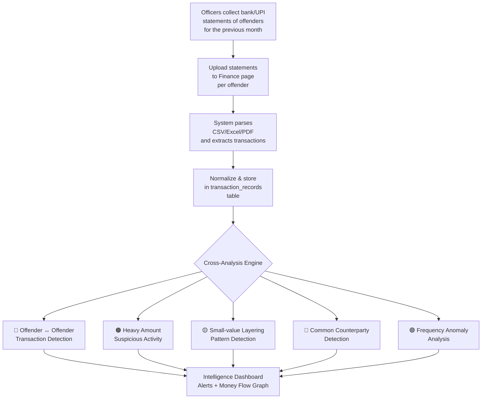
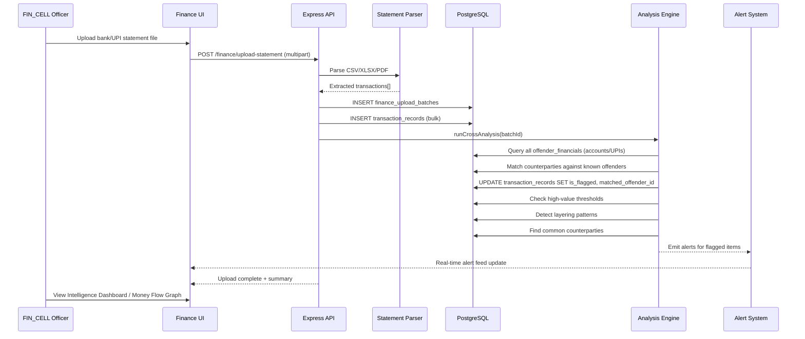

# Finance Intelligence Module — Implementation Prompt (Page 6)

**Module:** Financial Analysis — Intelligence Tab  
**Route:** `/finance`  
**Project:** GarudaNDPS_TPT (GARUDA)  
**Phase:** Phase 3 — Intelligence  
**Restricted To:** `FIN_CELL` department, `SP`, `ASP`, `DSP`, `ADMIN` ranks

---

## 🎯 Prompt for the AI / Agent

> **Implement the Finance Intelligence module (Page 6) of the GARUDA NDPS system.** This module enables the Financial Intelligence Cell to **upload monthly bank and UPI transaction statement files** (CSV/Excel/PDF) for every offender and consumer in the NDPS database. Once uploaded, the system must **automatically parse, normalize, and cross-analyze** all transactions to produce intelligence outputs: identifying **inter-offender money flows**, **suspicious high-value transactions**, **recurring small-value layering patterns**, **financier identification**, and **money-flow network graphs** — all without manual entry.

---

## 📋 Core Workflow (Customer Requirement)



---

## 📂 What Exists Today

| Component | Current State | File |
|-----------|--------------|------|
| Frontend Page | Placeholder shell with 6 tabs, no functionality | [FinancialAnalysis.jsx](file:///c:/Projects/GarudaNDPS_TPT/frontend/src/pages/finance/FinancialAnalysis.jsx) |
| Offender Financials Schema | Stores UPI IDs, bank accounts, IFSC per offender (static profile data) | [schema.prisma L202-214](file:///c:/Projects/GarudaNDPS_TPT/backend/prisma/schema.prisma#L202-L214) |
| Transaction Records Model | **Not yet created** — schema exists in [phase3 plan](file:///c:/Projects/GarudaNDPS_TPT/docs/phase3_implementation_plan.md#L47-L69) but not applied | N/A |
| Finance APIs | **Not implemented** — only `POST /api/finance/transactions` and `GET /api/finance/flow-map` are planned | N/A |
| RBAC | `FIN_CELL` department enum exists in [roles.ts](file:///c:/Projects/GarudaNDPS_TPT/backend/src/config/roles.ts) | Existing |

---

## 🏗️ High-Level Implementation Prompt (Core Feature)

### Step 1: Database Schema — Transaction Records & Upload Batches

Create two new Prisma models:

```prisma
// Batch upload tracking
model finance_upload_batches {
  id              BigInt            @id @default(autoincrement())
  uploaded_by     BigInt            // FK → users.id
  offender_id     BigInt            // FK → offenders.id — whose statement is this
  file_name       String            @db.VarChar(500)
  file_type       String            @db.VarChar(20) // CSV, XLSX, PDF
  statement_month DateTime          @db.Date        // the month the statement covers (e.g., 2026-06-01)
  bank_name       String?           @db.VarChar(150)
  account_no      String?           @db.VarChar(50)
  upi_id          String?           @db.VarChar(150)
  total_records   Int               @default(0)
  status          upload_status     @default(PROCESSING)
  error_log       String?           // any parse errors
  created_at      DateTime          @default(now()) @db.Timestamp(6)

  users           users             @relation(fields: [uploaded_by], references: [id])
  offenders       offenders         @relation(fields: [offender_id], references: [id], onDelete: Cascade)
  transactions    transaction_records[]
}

// Individual parsed transactions
model transaction_records {
  id               BigInt            @id @default(autoincrement())
  batch_id         BigInt            // FK → finance_upload_batches.id
  offender_id      BigInt            // FK → offenders.id (denormalized for fast queries)
  bank_name        String?           @db.VarChar(150)
  account_no       String?           @db.VarChar(50)
  upi_id           String?           @db.VarChar(150)
  transaction_ref  String?           @db.VarChar(100)
  amount           Decimal           @db.Decimal(12, 2)
  txn_date         DateTime          @db.Date
  direction        txn_direction     @default(OUTGOING) // INCOMING or OUTGOING
  txn_mode         txn_mode          @default(BANK)     // BANK, UPI, CASH, WALLET, NEFT, RTGS, IMPS
  counterparty_name    String?       @db.VarChar(200)   // name from statement
  counterparty_account String?       @db.VarChar(100)   // account/UPI of other party
  narration        String?           @db.VarChar(500)    // bank narration/description
  balance_after    Decimal?          @db.Decimal(12, 2)
  is_flagged       Boolean           @default(false)     // system-flagged as suspicious
  flag_reason      String?           @db.VarChar(500)    // reason for flagging
  matched_offender_id BigInt?        // FK → offenders.id — if counterparty is another known offender
  notes            String?
  created_at       DateTime          @default(now()) @db.Timestamp(6)

  batch            finance_upload_batches @relation(fields: [batch_id], references: [id], onDelete: Cascade)
  offenders        offenders         @relation(fields: [offender_id], references: [id], onDelete: Cascade)
}

enum upload_status {
  PROCESSING
  COMPLETED
  FAILED
  PARTIAL
}

enum txn_direction {
  INCOMING
  OUTGOING
}

enum txn_mode {
  BANK
  UPI
  CASH
  WALLET
  NEFT
  RTGS
  IMPS
}
```

> [!IMPORTANT]
> The `matched_offender_id` field is key — it stores the result of the cross-analysis engine when a counterparty matches another known offender's bank account or UPI ID.

---

### Step 2: Backend — Statement Upload & Parsing Engine

#### 2.1 File Upload API
```
POST /api/finance/upload-statement
```
- **Input:** multipart form — `file` (CSV/XLSX/PDF), `offenderId`, `statementMonth`, `bankName`, `accountNo`, `upiId`
- **Auth:** `FIN_CELL` department or `SP`/`ADMIN` rank
- **Flow:**
  1. Save upload metadata to `finance_upload_batches`
  2. Parse the file (see parser logic below)
  3. Insert rows into `transaction_records`
  4. Run the cross-analysis engine
  5. Update batch status to `COMPLETED` / `PARTIAL` / `FAILED`

#### 2.2 Statement Parsers (Support Multiple Formats)

| Format | Strategy |
|--------|----------|
| **CSV** | Use `csv-parser` or `papaparse` — auto-detect column headers (Date, Description/Narration, Debit, Credit, Balance) |
| **XLSX** | Use `xlsx` (already in project) — read first sheet, detect header row, map columns |
| **PDF** | Use `pdf-parse` — extract text, use regex/heuristics to detect tabular transaction data (date + amount + narration patterns) |

> [!TIP]
> Implement a **column mapping UI** on the frontend: after upload, show detected columns and let the officer confirm/remap column assignments (Date → txn_date, Debit → amount, etc.) before committing.

#### 2.3 Normalization Rules
- Normalize all dates to `YYYY-MM-DD`
- Separate Debit/Credit into `amount` + `direction` (INCOMING/OUTGOING)
- Extract counterparty info from narration (e.g., "UPI/CR/406912345678/JohnDoe@ybl" → counterparty_name: "JohnDoe", counterparty_account: "JohnDoe@ybl")
- Strip formatting from amounts (commas, currency symbols)

---

### Step 3: Backend — Cross-Analysis Intelligence Engine

This is the **core intelligence value** of the module. After every batch upload, run these analysis functions:

#### 3.1 🔴 Offender ↔ Offender Transaction Detection
```
Function: matchOffenderTransactions(batchId)
```
- For every transaction in the new batch, check if `counterparty_account` or `counterparty_name` matches any known offender's:
  - `offender_financials.value` (bank accounts, UPI IDs)
  - `offender_contacts.value` (phone numbers linked to UPI)
- If match found → set `matched_offender_id` on the transaction and `is_flagged = true`
- **Alert Priority:** HIGH — "Offender A has transacted ₹X with Offender B"

#### 3.2 🟠 High-Value Suspicious Transaction Detection
```
Function: flagHighValueTransactions(offenderId, thresholdAmount)
```
- Flag any single transaction above a configurable threshold (default: ₹50,000)
- Flag any cluster of transactions within a 24-hour window that sum above the threshold
- Consider offender's declared `monthly_income` from the offender profile — flag if single txn > 50% of declared income
- **Alert Priority:** HIGH

#### 3.3 🟡 Layering / Structuring Pattern Detection
```
Function: detectLayeringPatterns(offenderId, monthDate)
```
- Detect many small transactions (₹500–₹5,000) sent to the same counterparty within a short window (same day or consecutive days)
- Detect round-number clustering (multiple ₹2,000 or ₹5,000 transfers)
- Detect rapid in-out: money received and immediately forwarded to another party
- **Alert Priority:** MEDIUM — "Potential layering: 12 transactions of ~₹2,000 to same UPI in 3 days"

#### 3.4 🔵 Common Counterparty Detection
```
Function: findCommonCounterparties()
```
- Across ALL offenders' transaction records, find counterparty accounts/UPIs that appear in 2+ different offenders' statements
- Even if the counterparty is NOT a known offender, they may be an **unregistered financier or handler**
- **Alert Priority:** MEDIUM — "Unknown UPI xxxx@ybl received money from 4 different offenders"

#### 3.5 🟣 Temporal & Frequency Anomaly Analysis
```
Function: detectAnomalies(offenderId)
```
- Compare current month's transaction volume/frequency to previous months
- Flag sudden spikes in activity (e.g., 3x normal transaction count)
- Flag unusual timing (late-night transactions, weekend-only activity)
- Flag dormant accounts that suddenly become active
- **Alert Priority:** LOW-MEDIUM

#### 3.6 🟤 Financier Centrality & Network Analysis
```
Function: calculateFinancierCentrality()
```
- Construct a transaction flow graph using the **`graphology`** library in Node.js where nodes are offenders/counterparties and directed edges represent the total volume of money transferred.
- Run **PageRank** and **Degree Centrality** on this graph to identify key hubs (potential financiers, layerers, or handlers).
- Set alert priorities based on centrality score threshold spikes.

---

### Step 4: Backend — Intelligence Query APIs

```
GET  /api/finance/dashboard           → Summary stats: total uploads, flagged txns, offender-offender links
GET  /api/finance/uploads             → List all upload batches (paginated, filterable by offender/month)
GET  /api/finance/transactions        → Paginated transaction list with filters (offender, date range, flagged-only, amount range)
GET  /api/finance/alerts              → All flagged transactions grouped by alert type and priority
GET  /api/finance/offender-links      → Offender ↔ offender transaction pairs (for graph visualization)
GET  /api/finance/flow-map/:offenderId → Money flow graph built with `graphology` on the server: nodes (offenders + unknown counterparties) with calculated PageRank/centrality, and edges (aggregated transactions with amounts)
GET  /api/finance/common-counterparties → List of counterparties shared across multiple offenders
GET  /api/finance/analysis/monthly/:offenderId → Month-over-month analysis for a single offender
POST /api/finance/rerun-analysis/:batchId → Re-run cross-analysis on an existing batch
```

---

### Step 5: Frontend — Finance Intelligence UI

Replace the placeholder [FinancialAnalysis.jsx](file:///c:/Projects/GarudaNDPS_TPT/frontend/src/pages/finance/FinancialAnalysis.jsx) with a full working module:

#### Tab 1: 📤 Upload & Manage Statements
- **Drag-and-drop upload zone** with offender search/select
- Fields: Statement Month (date picker), Bank Name, Account No / UPI ID
- **Column mapping preview** after file parsed (show first 5 rows, let user confirm headers)
- Upload history table: batch ID, offender name, month, status, record count, upload date
- Re-upload / delete batch actions

#### Tab 2: 📊 Intelligence Dashboard
- **KPI Cards:**
  - Total statements uploaded this month
  - Total transactions parsed
  - 🔴 Offender-to-offender links found
  - 🟠 High-value suspicious transactions
  - 🟡 Layering patterns detected
  - 🔵 Common counterparties flagged
- **Recent Alerts feed** (real-time, sorted by priority)
- **Monthly trend chart** (Recharts — upload counts and flag counts over time)

#### Tab 3: 🔍 Transaction Explorer
- Full searchable, filterable, sortable table of all transactions
- Filters: Offender, Date range, Amount range, Direction, Flagged only, Matched offender only
- Flag indicator badges on suspicious rows
- Click a row → transaction detail modal showing narration, counterparty, flag reason, linked offender profile
- **Bulk actions:** Mark as reviewed, add investigator notes, export selection to Excel

#### Tab 4: 🕸️ Money Flow Graph
- **Interactive network visualization** using Cytoscape.js or react-flow
- Nodes = Offenders (colored by risk level) + Unknown counterparties (grey)
- Edges = Transactions with direction arrows and amount labels
- Node size scaled by total transaction volume
- Click a node → side panel with offender profile + transaction list
- Click an edge → show all transactions between those two parties
- Filters: Date range, minimum amount threshold, offender category
- **Highlight clusters** of interconnected offenders (financial networks)

#### Tab 5: 🏦 Offender Financial Profile
- Select an offender → show consolidated financial intelligence:
  - All known bank accounts and UPI IDs (from `offender_financials`)
  - Monthly transaction summary (income vs outflow chart)
  - Flagged transactions timeline
  - Linked offenders through financial transactions
  - Income-lifestyle discrepancy indicator (declared income vs actual money flow)
  - Statement upload history

#### Tab 6: 📋 Reports & Export
- **Suspicious Transaction Report** — Excel/PDF export of all flagged transactions for a given period
- **Offender Financial Dossier** — per-offender financial profile report
- **Inter-offender Money Flow Report** — all detected financial links between offenders
- **Monthly Intelligence Summary** — aggregated analysis for SP/DSP briefing

---

### Step 6: Alert Integration

Wire finance intelligence alerts into the existing SSE/notification system:

| Alert Type | Trigger | Priority | Recipients |
|------------|---------|----------|------------|
| Offender-Offender Txn | `matched_offender_id` set during analysis | 🔴 HIGH | FIN_CELL, SP, STF |
| High-Value Txn | Single txn or 24hr cluster above threshold | 🟠 HIGH | FIN_CELL, SP |
| Layering Pattern | Multiple small txns detected to same party | 🟡 MEDIUM | FIN_CELL |
| Common Counterparty | Same unknown party in 3+ offender statements | 🔵 MEDIUM | FIN_CELL, INTELLIGENCE |
| Frequency Spike | 3x+ normal transaction volume | 🟣 LOW | FIN_CELL |

---

## 🔐 Security Requirements

As per [security_standards.md](file:///c:/Projects/GarudaNDPS_TPT/docs/security_standards.md) and [phase3 CIA requirements](file:///c:/Projects/GarudaNDPS_TPT/docs/phase3_implementation_plan.md#L24-L41):

- **Access:** Finance module restricted to `FIN_CELL` department + `SP`/`ASP`/`ADMIN` ranks
- **PII Masking:** Analysts see masked account numbers (`XXXX-XXXX-4321`) unless explicit reveal (audit logged as `PII_REVEALED`)
- **Upload Audit:** Every upload logged to `audit_logs` with user, offender, file hash, and timestamp
- **Data Immutability:** Parsed transactions are read-only once imported. Corrections require re-upload of corrected statement
- **Encryption:** Bank account numbers and UPI IDs encrypted at rest (AES-256) — use existing `pii.ts` utility pattern

---

## ✅ Verification Plan

### Automated Tests
```bash
# Backend tests in backend/src/__tests__/finance.test.ts
- Test CSV upload → parse → store flow
- Test XLSX upload with column mapping
- Test offender-offender matching (seed 2 offenders with overlapping accounts)
- Test high-value flagging with configurable threshold
- Test layering pattern detection
- Test common counterparty detection across 3+ offenders
- Test RBAC — Constable gets 403, FIN_CELL gets 200
```

### Manual E2E Flow
1. Login as `FIN_CELL` officer
2. Navigate to `/finance` → Upload tab
3. Select an offender, upload a CSV bank statement
4. Verify column mapping preview, confirm and process
5. Check Transaction Explorer — all rows parsed correctly
6. Upload a second statement for a *different* offender, where some transactions have the same counterparty
7. Verify Intelligence Dashboard shows 🔴 offender link alert and 🔵 common counterparty alert
8. Open Money Flow Graph → verify nodes and edges render correctly
9. Export Suspicious Transaction Report → verify Excel/PDF output

---

## 📁 Files to Create / Modify

### Backend (New)
| File | Purpose |
|------|---------|
| `backend/src/controllers/finance.controller.ts` | Upload, parse, analysis engine, query APIs |
| `backend/src/routes/finance.routes.ts` | Route definitions |
| `backend/src/services/statementParser.ts` | CSV/XLSX/PDF parsing logic |
| `backend/src/services/financeAnalysis.ts` | Cross-analysis intelligence engine (built natively using `graphology` & `@graphology/metrics` for transaction graph PageRank/centrality) |
| `backend/src/__tests__/finance.test.ts` | Integration tests |

### Backend (Modify)
| File | Change |
|------|--------|
| `backend/prisma/schema.prisma` | Add `finance_upload_batches`, `transaction_records`, enums |
| `backend/src/server.ts` | Mount `/api/finance` routes |
| `backend/src/config/roles.ts` | Add `FINANCE_VIEW`, `FINANCE_UPLOAD`, `FINANCE_ANALYZE` permissions |

### Frontend (New/Replace)
| File | Purpose |
|------|---------|
| `frontend/src/pages/finance/FinancialAnalysis.jsx` | **Replace** placeholder with full tabbed module |
| `frontend/src/components/finance/StatementUpload.jsx` | Upload zone + column mapper |
| `frontend/src/components/finance/TransactionExplorer.jsx` | Filterable transaction table |
| `frontend/src/components/finance/MoneyFlowGraph.jsx` | Cytoscape.js network visualization |
| `frontend/src/components/finance/FinanceDashboard.jsx` | KPI cards + alert feed |
| `frontend/src/components/finance/OffenderFinProfile.jsx` | Per-offender financial dossier |

---

## 📊 Data Flow Summary



---

> [!CAUTION]
> **Critical Design Rule from the roadmap:** Do NOT duplicate accused/offender data in the finance module. All intelligence links go through `offender_id` foreign keys. The `offender_financials` table holds static profile data (accounts/UPI IDs). The `transaction_records` table holds actual transaction history parsed from statements. The intelligence comes from **cross-referencing** these two.

