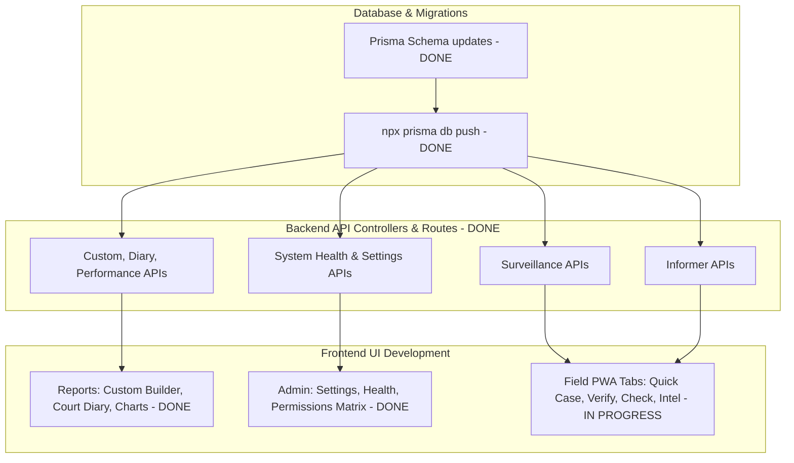

# Phase 2 — Operations Implementation Plan

**Goal:** Implement Page 4 (Field Staff), Page 8 (Reports Completion), Page 9 (Admin Completion), and Notifications v1.  
**Last Updated:** 2026-06-23  
**Status:** In Progress (Database & Backend APIs Complete; Page 8/9 UIs Complete; Field Staff UI & Tests remaining)

---

## Overview

Phase 2 shifts the GarudaNDPS application from standard case logging to active operations. This plan outlines the technical steps to make the **Field Staff** module fully operational, complete all analytical **Reports**, build **Admin configurations/health diagnostics**, and set up custom thresholds for alerts.



---

## Current Status Summary

1. **Database Schema (Completed)**:
   - Modified `schema.prisma` to add `informers` and `system_settings` models, and linked `intelligence_inputs` to `informers` (`informer_id`).
   - Pushed structural updates to the PostgreSQL instance via Prisma schema sync.
2. **Backend Controllers & Routers (Completed)**:
   - Surveillance: Created `surveillance.controller.ts` & `surveillance.routes.ts` with geo-tag check-ins and list views.
   - Informer Management: Created `informers.controller.ts` & `informers.routes.ts` with code names and rating tracking.
   - Settings & System Diagnostics: Created `settings.controller.ts` & `settings.routes.ts`.
   - Analytical Reports: Added `getCustomReport`, `getCourtDiary`, and `getPerformanceMetrics` in `reports.controller.ts` and registered their routes.
3. **Frontend UIs (Completed)**:
   - Centralized Reports (Page 8): Built Custom Report Builder, Excel Export, Court Diary agenda, and Performance Leaderboards using Recharts.
   - Centralized Admin (Page 9): Built Tab interface with CRUD user accounts, visual Permissions Matrix, Settings configurations, and Diagnostics status gauges.

---

## Proposed Remaining Implementation

### 1. Rebuild Field Staff Page (`FieldStaff.jsx`)
Replace the static "Coming in Phase 2" template inside [FieldStaff.jsx](file:///c:/Projects/GarudaNDPS_TPT/frontend/src/pages/field/FieldStaff.jsx) with a highly interactive, responsive mobile operational tool:

#### Tab 1: Quick Case Entry
- **GPS Coordinates**: Detect automatically on tab render using browser `navigator.geolocation` APIs and display active coordinate tags.
- **Inputs**: FIR Number (optional, falls back to autogeneration), Police Station select (defaulting to the logged-in officer's station), Section of law, Contraband Type (contraband type enum select), Quantity, Quantity Unit, Street Value, Source, and Destination.
- **Voice typing (Web Speech API)**: Render a microphone button inside the "Intelligence Notes" summary field to let officers speak notes hands-free in the field.
- **Photo Stub**: Allow selecting a photo, showcasing a local thumbnail preview, and storing mock photo paths.
- **Submit**: Posts to `POST /api/cases`.

#### Tab 2: Accused Verification
- **Lookup Query**: Search input by Name, Mobile Number, or Aadhaar document number.
- **Search Results**: Call `/api/offenders?query=xxx` and list match cards.
- **Accused Dossier Modal**: Clicking an accused fetches their profile details from `GET /api/offenders/:id`:
  - Show photo, status (Active/Bailed/Absconding), risk level, and category.
  - Display Aadhaar (masked unless SP/ASP rank with reveal privileges).
  - Chronological timeline of all linked case profiles (fetched from `GET /api/cases/offender/:id`).
  - Active warrants or outstanding alerts badges.

#### Tab 3: GPS-Tagged Surveillance Check-in
- **Target Selection**: Searchable dropdown to choose active offenders.
- **Surveillance Actions**: Log status as `COMPLETED` or `MISSED`.
- **Inputs**: Current Observed Address, Occupation changes, Associates observed, and general field notes.
- **Coordinates**: Captures GPS location automatically via geolocation.
- **Submit**: Posts directly to `POST /api/surveillance`.

#### Tab 4: Informer Management (Restricted Ranks)
- **RBAC protection**: Only visible to ranks `SI` and above in the `OPERATIONS`, `STF`, or `INTELLIGENCE` departments. Shows an access denied state or hides the tab for Constables.
- **Register Informer Form**: Record Informers with an unique code name (to protect their identity), optional phone, and a reliability rating (`A`, `B`, `C`, `D`). Submits to `POST /api/informers`.
- **Active Informer List**: Table showing code name, ratings, active status toggle, and registration date.
- **Log Tip-off Form**: Let officers record a intelligence tip-off linked to a specific registered informer (posts to `POST /api/intelligence` passing `informer_id`).

#### Tab 5: Checkpoint / Nakabandhi Logs
- **Form Integration**: Directly import and render `VehicleCheckForm` from `c:\Projects\GarudaNDPS_TPT\frontend\src\components\enforcement\forms\VehicleCheckForm.jsx` inside the tab container.
- Provide a clean cancellation and success handling callback to reset states.

---

### 2. Automated Integration Test Suite
To maintain stability, we will build backend integration tests under `backend/src/__tests__/`:

- **`surveillance.test.ts`**:
  - Test creating a geo-tagged surveillance check-in.
  - Test fetching history logs for an offender.
- **`informers.test.ts`**:
  - Test registration and validation rules.
  - Test rank/department authorization enforcement (Constable gets 403, SI gets 200).
- **`reports_ops.test.ts`**:
  - Test fetching custom report datasets and validating filters.
  - Test court diary dates logic.

---

## Verification Plan

### Automated Tests
Run Jest tests to verify endpoint responses and DB consistency:
```bash
cmd /c "npm test"
```

### Manual E2E Validation Flow
1. **Officer Login (Constable)**:
   - Navigate to `/mobile`.
   - Accept Geolocation access.
   - Verify coordinates load. Fill in and submit a Quick Case check-in.
   - Navigate to "Informer Management" and verify access is blocked or tab is invisible.
   - Go to "Checkpoint Log" and complete a mock vehicle registration check.
2. **Supervisor Login (SI / SP)**:
   - Navigate to `/mobile` -> "Informer Management".
   - Register a new informer under code name `INF-Tirupati-99`.
   - Log a tip-off from `INF-Tirupati-99` and verify it gets recorded in the backend.
   - Go to `/reports` and verify "Custom Builder" exports reports correctly.
