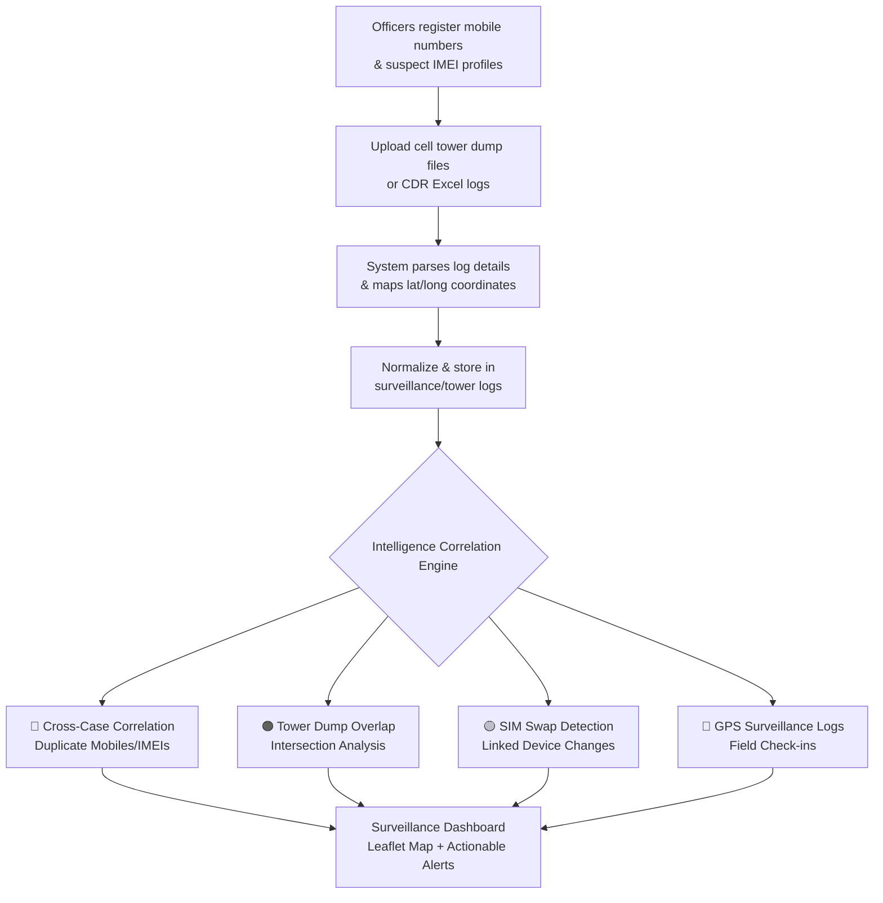

# Technical Surveillance Module — Implementation Prompt (Page 5)

**Module:** Technical Surveillance — Intelligence Tab  
**Route:** `/surveillance`  
**Project:** GarudaNDPS_TPT (GARUDA)  
**Phase:** Phase 3 — Intelligence  
**Restricted To:** `TECH_CELL`, `CYBER_ANALYTICS` departments, `SP`, `ASP`, `DSP`, `ADMIN`, `ANALYST` ranks/departments

---

## 🎯 Prompt for the AI / Agent

> **Implement the Technical Surveillance module (Page 5) of the GARUDA NDPS system.** This module enables the Cyber & Technical Surveillance Cell to **track suspect mobile numbers, monitor IMEI devices, upload CDR/tower logs, log social/messaging intelligence, and run a geo-location overlay map.** Once inputs are logged, the system must **automatically detect cross-case correlations** (identifying duplicate mobile/IMEI usage across distinct cases), **find tower dump overlaps** (intersecting devices present at multiple crime scenes), and **log SIM swap events** — producing immediate actionable intelligence for the STF and SP.

---

## 📋 Core Workflow (Customer Requirement)



---

## 📂 What Exists Today

| Component | Current State | File |
|-----------|--------------|------|
| Frontend Page | Placeholder shell with 6 tabs, no working components | [Surveillance.jsx](file:///c:/Projects/GarudaNDPS_TPT/frontend/src/pages/surveillance/Surveillance.jsx) |
| IMEI Records Model | Basic fields exist, but no active controllers or APIs | [schema.prisma L162-184](file:///c:/Projects/GarudaNDPS_TPT/backend/prisma/schema.prisma#L162-L184) |
| Surveillance Records Model | Exists for field staff visits, but lacks geo-location mapping | [schema.prisma L457-477](file:///c:/Projects/GarudaNDPS_TPT/backend/prisma/schema.prisma#L457-L477) |
| Tower Dump Logs | **Not yet created** — planned schema exists in plan | N/A |
| Intelligence Inputs | Existing table, needs integration | [schema.prisma L103-123](file:///c:/Projects/GarudaNDPS_TPT/backend/prisma/schema.prisma#L103-L123) |
| RBAC | Permissions and departments exist | [roles.ts](file:///c:/Projects/GarudaNDPS_TPT/backend/src/config/roles.ts) |

---

## 🏗️ High-Level Implementation Prompt (Core Feature)

### Step 1: Database Schema — Tower Logs, Social & Messaging Intel

Update `schema.prisma` to include the following models:

```prisma
// Tower dump match logs (Page 5)
model tower_match_logs {
  id               BigInt            @id @default(autoincrement())
  case_id          BigInt
  mobile_number    String            @db.VarChar(20)
  latitude         Decimal           @db.Decimal(10, 7)
  longitude        Decimal           @db.Decimal(10, 7)
  hit_time         DateTime          @db.Timestamp(6)
  cell_tower_id    String            @db.VarChar(100)
  provider         String?           @db.VarChar(50)
  created_at       DateTime          @default(now()) @db.Timestamp(6)

  cases            cases             @relation(fields: [case_id], references: [id], onDelete: Cascade)
  
  @@index([case_id], map: "idx_tml_case")
  @@index([mobile_number], map: "idx_tml_mobile")
  @@index([hit_time], map: "idx_tml_time")
}

// Social Media Intelligence Inputs
model social_media_intel {
  id              BigInt            @id @default(autoincrement())
  offender_id     BigInt
  platform        String            @db.VarChar(50)   // Facebook, Instagram, Telegram, WhatsApp, X
  handle_or_url   String            @db.VarChar(500)
  rating          intel_rating      @default(UNVERIFIED)
  notes           String?
  created_by      BigInt
  created_at      DateTime          @default(now()) @db.Timestamp(6)

  offenders       offenders         @relation(fields: [offender_id], references: [id], onDelete: Cascade)
  users           users             @relation("social_created_by", fields: [created_by], references: [id])

  @@index([offender_id], map: "idx_smi_offender")
  @@index([platform], map: "idx_smi_platform")
}

// Messaging platform tip-offs & intercepts
model messaging_intel {
  id              BigInt            @id @default(autoincrement())
  offender_id     BigInt
  platform        String            @db.VarChar(50)   // Telegram, WhatsApp, Signal
  source_type     intel_source      @default(TIP_OFF) // INFORMER, TIP_OFF, INTERCEPT
  disposition     String?           @db.VarChar(100)  // Active, Closed, Monitoring
  input_text      String            @db.Text
  created_by      BigInt
  created_at      DateTime          @default(now()) @db.Timestamp(6)

  offenders       offenders         @relation(fields: [offender_id], references: [id], onDelete: Cascade)
  users           users             @relation("messaging_created_by", fields: [created_by], references: [id])

  @@index([offender_id], map: "idx_msi_offender")
  @@index([source_type], map: "idx_msi_source")
}

enum intel_rating {
  CONFIRMED
  PROBABLE
  UNVERIFIED
}

enum intel_source {
  INFORMER
  TIP_OFF
  INTERCEPT
}
```

> [!IMPORTANT]
> Ensure the appropriate back-relations are added to the `offenders`, `cases`, and `users` models.

---

### Step 2: Backend — Tower Dump Ingestion & Parsing

#### 2.1 Tower Dump File Upload API
```
POST /api/surveillance/tower-dump
```
- **Input:** multipart form — `file` (CSV/XLSX), `caseId`
- **Auth:** `TECH_CELL`, `CYBER_ANALYTICS` departments or `SP`/`ADMIN` rank
- **Flow:**
  1. Parse the uploaded Excel or CSV tower logs.
  2. The parser must dynamically look for headers matching: `Mobile Number`, `MSISDN`, `Cell ID`, `Tower ID`, `Timestamp`, `Date`, `Time`, `Latitude`, `Longitude` (providing defaults if geo-coordinates are missing or mapping via tower cell registry if available).
  3. Bulk insert parsed records into the `tower_match_logs` table.
  4. Run the Tower intersection engine to detect overlaps with existing cases.

---

### Step 3: Backend — Intelligence Correlation Engine

#### 3.1 🔴 Cross-Case Correlation (Duplicate Mobiles/IMEIs)
- Whenever a new phone number or IMEI is added (either via `offender_contacts`, `imei_records`, or `tower_match_logs`), check if that number/IMEI exists in:
  - Any other offender profile under a different case.
  - Any other case tower dump match log.
- If a match is found → trigger a real-time notification alert: `"Mobile number [masked] appears in Case A (FIR XX/2026) and Case B (FIR YY/2026)"`.

#### 3.2 🟠 Tower Dump Overlap Engine
- Function `findTowerIntersections(caseIds: BigInt[])`
- Query the database to find `mobile_number`s that appear in all selected `case_ids` within a configurable time window (e.g., ±30 mins of the offence time).
- Return a list of overlapping numbers, their total hits, and the coordinate locations.

#### 3.3 🟡 SIM Swap Detection
- For `imei_records`, monitor changes where:
  - An existing `imei_number` is registered with a different `mobile_number`.
  - An existing `mobile_number` is registered with a different `imei_number`.
- Log these changes as a history and generate a `SIM_SWAP` alert priority level: **HIGH**.

---

### Step 4: Backend — Surveillance APIs

```
GET  /api/surveillance/dashboard      → Summary stats of active logs, SIM swaps, and correlation alerts
POST /api/surveillance/mobile         → Add mobile number tracking link for a suspect
GET  /api/surveillance/mobiles        → List all tracked mobile numbers (with pagination and filter by case/offender)
POST /api/surveillance/imei           → Add IMEI registry tracking record
GET  /api/surveillance/imeis          → List all IMEI entries and SIM swap histories
GET  /api/surveillance/map-logs       → Get Geo-JSON formatted coordinates for check-in logs and cell towers
POST /api/surveillance/social         → Log social media intelligence inputs
POST /api/surveillance/messaging      → Log messaging intercept intelligence inputs
GET  /api/surveillance/correlations   → Retrieve list of duplicate number/IMEI alerts across cases
```

---

### Step 5: Frontend — Technical Surveillance UI

Replace [Surveillance.jsx](file:///c:/Projects/GarudaNDPS_TPT/frontend/src/pages/surveillance/Surveillance.jsx) with a fully functional tabbed module:

#### Tab 1: 📞 Mobile Analysis
- List of tracked mobile numbers with offender photo, status (Active/Dormant), and provider.
- Quick action to "Add Mobile Link" to search/link to any existing offender.
- Display a timeline of status changes or network shifts.

#### Tab 2: 📱 IMEI Tracking Register
- Interactive table of logged IMEIs showing: Device Make/Model, Current SIM, Status, and Last Seen.
- Expandable rows showing the **SIM Swap History** timeline (displaying when cards changed).
- Action buttons to add IMEI tracking sheets.

#### Tab 3: 🗺️ Geo-Location Map
- Incorporate a **Leaflet.js** map container.
- Plot GPS-tagged surveillance check-in logs (markers color-coded by offender risk score).
- Plot cell tower markers (with custom tower icons and coverage radii drawn using SVG circles).
- Filter panel: Toggle check-ins, tower markers, date range sliders, and risk levels.
- Clicking a tower or marker displays a popup showing logs, timestamp, and details.

#### Tab 4: 📣 Social Media Intelligence
- Form to log platforms handles: `offender_id` select dropdown, Platform select (Facebook, Instagram, X, WhatsApp, Telegram), Handle/URL string, Rating select (Confirmed, Probable, Unverified), and Investigation notes.
- Feed list showing latest social media intel items with badge colors matching ratings.

#### Tab 5: 💬 Messaging Intelligence
- Form to log encrypted platform intelligence: Source Type select (Informer, Tip-off, Intercept), platform name, disposition status, and input text text-area.
- Log tracking panel with search filters.

#### Tab 6: 🔗 Intelligence Correlation & Tower Dump
- **Tower Dump Upload section**: File selector + Case selector + Ingest button.
- **Intersection Finder**: Select 2 or more cases and click "Find Overlapping Devices" to list mobile numbers matching both tower regions.
- **Cross-case Alerts Feed**: Panel listing all cases linked together via overlapping IMEIs or telephone numbers.

---

### Step 6: Alert Integration

Integrate the following technical surveillance alerts into the Server-Sent Events (SSE) notification dashboard:

| Alert Type | Trigger | Priority | Department / Rank Recipients |
|------------|---------|----------|-----------------------------|
| Cross-Case Mobile match | Mobile number found in 2+ cases | 🔴 HIGH | TECH_CELL, STF, SP |
| Cross-Case IMEI match | IMEI number found in 2+ cases | 🔴 HIGH | TECH_CELL, STF, SP |
| SIM Swap Detected | IMEI updates with new phone number | 🔴 HIGH | TECH_CELL, CYBER_ANALYTICS |
| Tower Dump Overlap | Common number detected in case intersection | 🟠 HIGH | TECH_CELL, STF |
| New Social/Messaging Log | Verified platform intelligence input logged | 🟡 MEDIUM | CYBER_ANALYTICS, INTELLIGENCE |

---

## 🔐 Security Requirements

- **Role Restrictions:** Block all surveillance write APIs from officers unless they belong to `TECH_CELL`, `CYBER_ANALYTICS` or have rank >= `SP`.
- **PII Masking:** Raw mobile numbers and IMEI strings must be masked by default (e.g., `XXXXXX1234` or `IMEI-*****6789`) for all `ANALYST` views unless a "Reveal" button is clicked.
- **Audit Trails:** Ensure every "Reveal PII" action on mobile/IMEI triggers an immutable `audit_logs` record with action type `PII_REVEALED`.

---

## ✅ Verification Plan

### Automated Tests
```bash
# Run backend tests in backend/src/__tests__/surveillance.test.ts
- Test Excel/CSV Tower dump upload → Parse → Store
- Test cross-case correlation matches (insert same IMEI for two different offenders and assert alert)
- Test Tower dump intersection query matching two scenes
- Test SIM swap history creation on IMEI updates
- Test RBAC blocking general CONSTABLE rank from posting logs
```

### Manual Verification
1. Login as `TECH_CELL` officer.
2. Upload a sample Tower Dump CSV containing 10 phone logs for Case A.
3. Upload a second Tower Dump CSV for Case B containing 5 logs, where 1 number overlaps.
4. Verify the **Correlation & Tower Dump** tab shows the overlap device immediately.
5. Verify the **Geo-Location Map** renders the coordinates and coverage circles.
6. Open **IMEI Register** and change the mobile number associated with a tracked IMEI; verify a SIM Swap alert triggers in the feed.

---

## 📁 Files to Create / Modify

### Backend (New)
- `backend/src/controllers/surveillance.controller.ts` (Ingestion, overlap finder, correlation queries, and messaging logs)
- `backend/src/routes/surveillance.routes.ts` (Surveillance route setup)
- `backend/src/services/towerParser.ts` (Ingestion parser for tower logs)
- `backend/src/__tests__/surveillance.test.ts` (Surveillance unit/integration tests)

### Backend (Modify)
- `backend/prisma/schema.prisma` (Add `tower_match_logs`, `social_media_intel`, `messaging_intel`, and enums)
- `backend/src/server.ts` (Mount `/api/surveillance` routes)

### Frontend (New/Replace)
- `frontend/src/pages/surveillance/Surveillance.jsx` (Replace placeholder with full tabbed implementation)
- `frontend/src/components/surveillance/MobileAnalysis.jsx` ( Suspect mobile register)
- `frontend/src/components/surveillance/ImeiRegister.jsx` (IMEI register and SIM swap timeline)
- `frontend/src/components/surveillance/SurveillanceMap.jsx` (Leaflet map showing GPS checks & towers)
- `frontend/src/components/surveillance/IntelLogs.jsx` (Social media and messaging intel inputs)
- `frontend/src/components/surveillance/TowerCorrelation.jsx` (Tower dump upload and overlap analysis UI)
