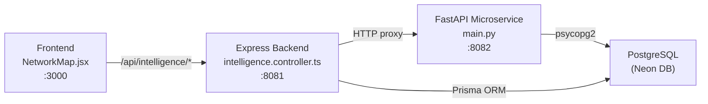

# Network & Chain Analysis — How It Works & Improvement Plan

## How It Currently Works

The Network & Chain Analysis page ([NetworkMap.jsx](file:///c:/Projects/GarudaNDPS_TPT/frontend/src/pages/network/NetworkMap.jsx)) is a **3-tier system** connecting the React frontend → Node.js Express backend → Python FastAPI microservice, all reading from a shared PostgreSQL (Neon) database.

### Architecture Diagram



### Data Flow Per Tab

| Tab | Data Source | API Route Chain | Engine |
|-----|-----------|----------------|--------|
| **Chain Builder** | `offenders` + `supply_chain_links` tables | Frontend → `GET /api/intelligence/network-graph` → Backend proxy → FastAPI `GET /analytics/network-graph` | Python NetworkX: builds directed graph, computes PageRank + degree centrality |
| **Network Clusters** | `offender_contacts` + `imei_records` tables | Frontend → `GET /api/intelligence/duplicate-contacts` → Backend proxy → FastAPI `GET /analytics/duplicate-contacts` | Raw SQL: `GROUP BY value HAVING COUNT > 1` for phones and IMEIs |
| **Kingpin Profiling** | Reuses Chain Builder node data + manual form input | PageRank table: reuses `nodes[]` from Chain Builder. Risk Calculator: `POST /api/intelligence/predict-risk` → FastAPI `POST /analytics/predict-risk` | Heuristic scoring engine (rule-based, not true ML) |
| **Interstate Links** | ❌ Hardcoded static data | None — displays 3 fixed route strings | No backend — purely static HTML |
| **Consignment Trail** | ❌ Hardcoded static data | None — displays 1 fixed consignment card | No backend — purely static HTML |
| **Case Linkage** | ❌ Hardcoded static data | None — displays 1 fixed ring card | No backend — purely static HTML |

### How the Chain Builder Graph Works

1. **Python microservice** queries all `offenders` and `supply_chain_links` from the DB
2. Builds a **NetworkX DiGraph** where each offender is a node and each supply chain link is a directed edge
3. Runs **PageRank** (`alpha=0.85`) and **degree centrality** on the graph
4. Returns `{nodes[], edges[], summary}` to the frontend
5. Frontend renders a **custom Canvas force-directed layout** (no library — hand-rolled physics simulation with repulsion, attraction, damping, and gravity)
6. Users can click nodes to see details in a sidebar, drag nodes to reposition, and double-click to navigate to the offender dossier

### Key Database Tables Involved

| Table | Role |
|-------|------|
| [offenders](file:///c:/Projects/GarudaNDPS_TPT/backend/prisma/schema.prisma#L229-L277) | Node data: `id, full_name, alias, category, risk_score, ps_id` |
| [supply_chain_links](file:///c:/Projects/GarudaNDPS_TPT/backend/prisma/schema.prisma#L440-L455) | Edge data: `offender_id → linked_offender_id`, `link_type` (CO_CONSUMER, PEDDLER, SUPPLIER, TRANSPORTER, KINGPIN) |
| [offender_contacts](file:///c:/Projects/GarudaNDPS_TPT/backend/prisma/schema.prisma#L148-L160) | Phone correlation: `contact_type` (MOBILE_PRIMARY, MOBILE_SECONDARY), `value` |
| [imei_records](file:///c:/Projects/GarudaNDPS_TPT/backend/prisma/schema.prisma#L162-L180) | Device correlation: `imei_number, device_make, sim_number` |
| [case_accused](file:///c:/Projects/GarudaNDPS_TPT/backend/prisma/schema.prisma#L28-L47) | Case-offender junction: `case_id + offender_id` (needed for Case Linkage) |
| [cases](file:///c:/Projects/GarudaNDPS_TPT/backend/prisma/schema.prisma#L49-L86) | Case data with `source_location, destination_location, contraband_type` |

---

## Issues & Gaps

### 🔴 Critical Issues

1. **3 of 6 tabs are completely static/fake** — Interstate Links, Consignment Trail, and Case Linkage show hardcoded placeholder data, not real DB content
2. **Sync Indicator is misleading** — Shows "Connected" even when the microservice is down (partially fixed in previous session)
3. **No station scoping on duplicate-contacts** — The phone/IMEI correlation endpoint returns data across ALL stations regardless of the user's role

### 🟡 Functional Gaps

4. **Kingpin table requires Chain Builder to load first** — If you go directly to Kingpin tab, the table is empty because `nodes[]` state is only populated when Chain Builder tab loads
5. **No edge labels visible on the graph** — Link types (SUPPLIER, TRANSPORTER, etc.) exist in the data but are not rendered on the canvas edges
6. **Canvas graph has no zoom/pan** — With many nodes the graph becomes unreadable
7. **No way to manually add/edit supply chain links** from this page (must go to OffenderForm)
8. **Risk predictor uses `alert()` for errors** — Uses a raw JavaScript alert instead of proper toast/error state

### 🔵 Enhancement Opportunities

9. **Co-arrest linkage**: Offenders appearing in the same case (via `case_accused`) should automatically form implicit edges in the network graph
10. **Interstate routes from real data**: Cases have `source_location` and `destination_location` fields that could power the Interstate Links tab with actual seizure route data
11. **Case linkage from shared suspects**: Two cases sharing the same accused should be linked, enabling the Case Linkage tab

---

## Proposed Changes

### Phase A — Quick Fixes (Low Effort)

> [!NOTE]
> These are bug fixes and small improvements that can be done without new APIs or schema changes.

#### [MODIFY] [NetworkMap.jsx](file:///c:/Projects/GarudaNDPS_TPT/frontend/src/pages/network/NetworkMap.jsx)

- **Auto-load graph data on mount** regardless of active tab, so Kingpin Profiling table always has data
- **Replace `alert()` in `runPredictor`** with inline error state display
- **Render edge type labels** on the canvas between connected nodes (show "SUPPLIER", "TRANSPORTER" etc.)
- **Add node count badge** to the Chain Builder tab header showing `{summary.total_nodes} nodes, {summary.total_edges} edges`

---

### Phase B — Make Static Tabs Functional (Medium Effort)

> [!IMPORTANT]
> This is the highest-impact work — turning 3 placeholder tabs into real, data-driven features.

#### Tab 4: Interstate Links — Pull from Real Case Data

##### [NEW] FastAPI endpoint: `GET /analytics/interstate-routes`

Query `cases` table for records where `source_location` and `destination_location` are populated. Group by route pair and aggregate contraband type/quantity to build a route matrix.

```python
# Returns: [{source, destination, contraband_type, total_quantity, case_count}]
```

##### [MODIFY] [intelligence.controller.ts](file:///c:/Projects/GarudaNDPS_TPT/backend/src/controllers/intelligence.controller.ts)

Add `getInterstateRoutes` proxy controller.

##### [MODIFY] [intelligence.routes.ts](file:///c:/Projects/GarudaNDPS_TPT/backend/src/routes/intelligence.routes.ts)

Register `GET /interstate-routes`.

##### [MODIFY] [NetworkMap.jsx](file:///c:/Projects/GarudaNDPS_TPT/frontend/src/pages/network/NetworkMap.jsx)

Replace the static Interstate Links tab content with a data-driven route matrix table, loading from the new API.

---

#### Tab 5: Consignment Trail — Pull from Cases + Seizures

##### [NEW] FastAPI endpoint: `GET /analytics/consignment-trails`

Join `cases` → `seizures` → `case_accused` → `offenders` to build consignment records showing: FIR, contraband type, quantity, street value, accused names, and route.

```python
# Returns: [{fir_no, ps_name, contraband_type, quantity, street_value, source, destination, accused_names[], case_date}]
```

##### [MODIFY] Backend + Routes

Add controller proxy and route registration (same pattern as above).

##### [MODIFY] [NetworkMap.jsx](file:///c:/Projects/GarudaNDPS_TPT/frontend/src/pages/network/NetworkMap.jsx)

Replace the static Consignment Trail tab with a sortable/filterable table of real consignment records.

---

#### Tab 6: Case Linkage — Shared Accused Detection

##### [NEW] FastAPI endpoint: `GET /analytics/case-linkage`

Find cases that share accused persons. Query `case_accused` grouped by `offender_id` having `COUNT(case_id) > 1`, then build linkage clusters.

```python
# Returns: [{offender_name, offender_id, linked_cases: [{case_id, fir_no, ps_name, case_date}], case_count}]
```

##### [MODIFY] Backend + Routes

Add controller proxy and route registration.

##### [MODIFY] [NetworkMap.jsx](file:///c:/Projects/GarudaNDPS_TPT/frontend/src/pages/network/NetworkMap.jsx)

Replace the static Case Linkage tab with linkage cluster cards showing shared accused and their connected cases.

---

### Phase C — Advanced Enhancements (Higher Effort)

> [!TIP]
> These are stretch goals that significantly improve the intelligence value of the page.

#### C1: Co-Arrest Implicit Edges in Chain Builder

##### [MODIFY] FastAPI `GET /analytics/network-graph`

After building the supply chain graph, also query `case_accused` to find offenders who appear in the same case. Add implicit edges with `type: "CO_ARREST"` for pairs not already connected via `supply_chain_links`. This reveals hidden networks automatically.

#### C2: Canvas Zoom/Pan Support

##### [MODIFY] [NetworkMap.jsx](file:///c:/Projects/GarudaNDPS_TPT/frontend/src/pages/network/NetworkMap.jsx)

Add mouse wheel zoom and click-drag pan to the canvas viewport using a transform matrix. This is essential for readability when the graph has 50+ nodes.

#### C3: Station Scoping for Duplicate Contacts

##### [MODIFY] FastAPI `GET /analytics/duplicate-contacts`

Accept `ps_id` parameter and filter `offender_contacts` and `imei_records` by the offender's `ps_id`. Pass `ps_id` from the backend proxy (same pattern as `network-graph`).

#### C4: Network Summary Statistics

##### [MODIFY] [NetworkMap.jsx](file:///c:/Projects/GarudaNDPS_TPT/frontend/src/pages/network/NetworkMap.jsx)

Add a summary bar below the tabs showing: `{total_nodes} Suspects | {total_edges} Links | {isolated_count} Isolated | Top Hub: {top_pagerank_name}`.

---

## Open Questions

> [!IMPORTANT]
> **Interstate Routes data**: Do your current cases have `source_location` and `destination_location` populated, or are those fields mostly empty? If empty, the Interstate Links tab would still show "No data" until cases are updated.

> [!IMPORTANT]
> **Co-arrest edges**: Should co-arrest implicit links be shown as **dashed lines** (to distinguish them from explicit supply chain links), or should they be treated the same?

> [!IMPORTANT]
> **Priority**: Would you prefer I tackle Phase B (making static tabs functional) first, or Phase A (bug fixes) first?

---

## Verification Plan

### Automated Tests
- Verify new FastAPI endpoints return correct data with `curl` commands against port 8082
- Verify Express proxy routes return wrapped `successResponse` format

### Manual Verification
- Navigate to each tab and confirm real data loads
- Verify station-scoped users only see their station's data
- Test with the browser to confirm Canvas rendering works with new edge labels
